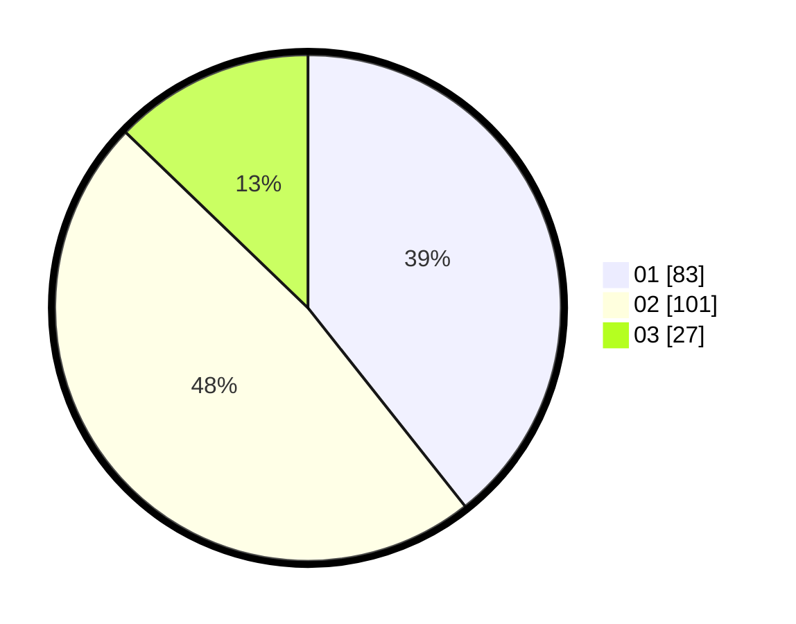

# Hasil

Hasil perolehan suara paslon dapat dilihat pada file paslon-01.txt, paslon-02.txt, dan paslon-03.txt.

Jika tidak ada, artinya data tersebut belum ada pada SIREKAP.

## Perolehan Suara

 * Paslon 01: **83**.
 * Paslon 02: **101**.
 * Paslon 03: **27**.

## Foto C Plano

https://sirekap-obj-formc.kpu.go.id/566b/pemilu/ppwp/31/73/06/10/03/3173061003201-20240214-231737--3a9e5e28-b9c6-43fd-a0dc-385672c2564e.jpg

https://sirekap-obj-formc.kpu.go.id/566b/pemilu/ppwp/31/73/06/10/03/3173061003201-20240214-231051--3c2c6672-0d4e-443f-8a54-1e11f58343f1.jpg

https://sirekap-obj-formc.kpu.go.id/566b/pemilu/ppwp/31/73/06/10/03/3173061003201-20240214-232013--23b20aca-e8b0-472e-b827-10075a72b308.jpg
