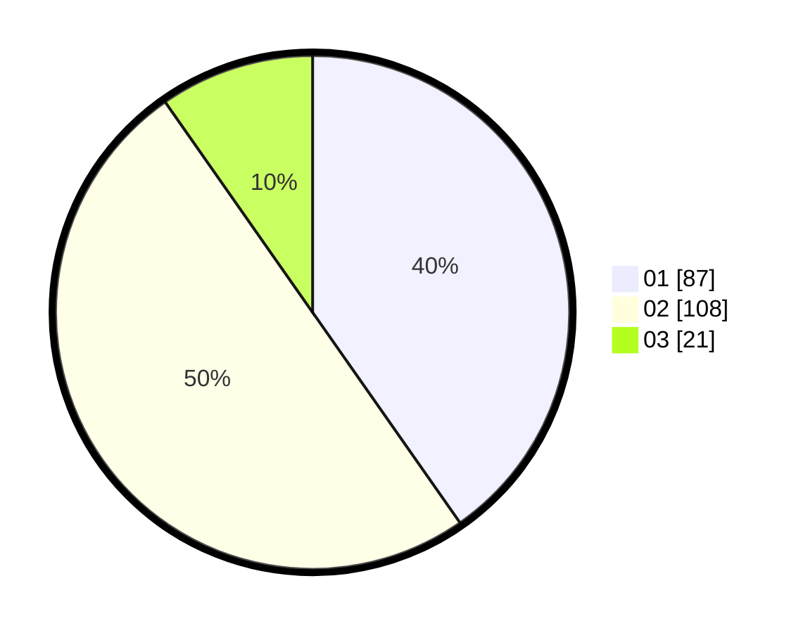

# Hasil

Hasil perolehan suara paslon dapat dilihat pada file paslon-01.txt, paslon-02.txt, dan paslon-03.txt.

Jika tidak ada, artinya data tersebut belum ada pada SIREKAP.

## Perolehan Suara

 * Paslon 01: **87**.
 * Paslon 02: **108**.
 * Paslon 03: **21**.

## Foto C Plano

https://sirekap-obj-formc.kpu.go.id/f208/pemilu/ppwp/31/73/06/10/03/3173061003202-20240214-155918--9e6843a1-9422-41ec-ad5f-5d61802ef052.jpg

https://sirekap-obj-formc.kpu.go.id/f208/pemilu/ppwp/31/73/06/10/03/3173061003202-20240214-155805--335f7824-c60f-4006-9699-1f548e623662.jpg

https://sirekap-obj-formc.kpu.go.id/f208/pemilu/ppwp/31/73/06/10/03/3173061003202-20240214-155858--1986b1e6-e247-4707-8b00-f80901a9f494.jpg

## DATA PEMILIH TETAP

Jumlah pemilih dalam DPT: **292**.
 * L: **142**.
 * P: **150**.

## DATA PENGGUNA HAK PILIH

Jumlah pengguna hak pilih dalam DPT: **219**.
 * L: **104**.
 * P: **115**.

Jumlah pengguna hak pilih dalam DPTb: **0**.
 * L: **0**.
 * P: **0**.

Jumlah pengguna hak pilih dalam DPK: **3**.
 * L: **1**.
 * P: **2**.

Jumlah pengguna hak pilih: **222**.
 * L: **105**.
 * P: **117**.

## JUMLAH SUARA SAH DAN TIDAK SAH

JUMLAH SELURUH SUARA SAH: **216**.

JUMLAH SUARA TIDAK SAH: **6**.

JUMLAH SELURUH SUARA SAH DAN SUARA TIDAK SAH: **222**.
