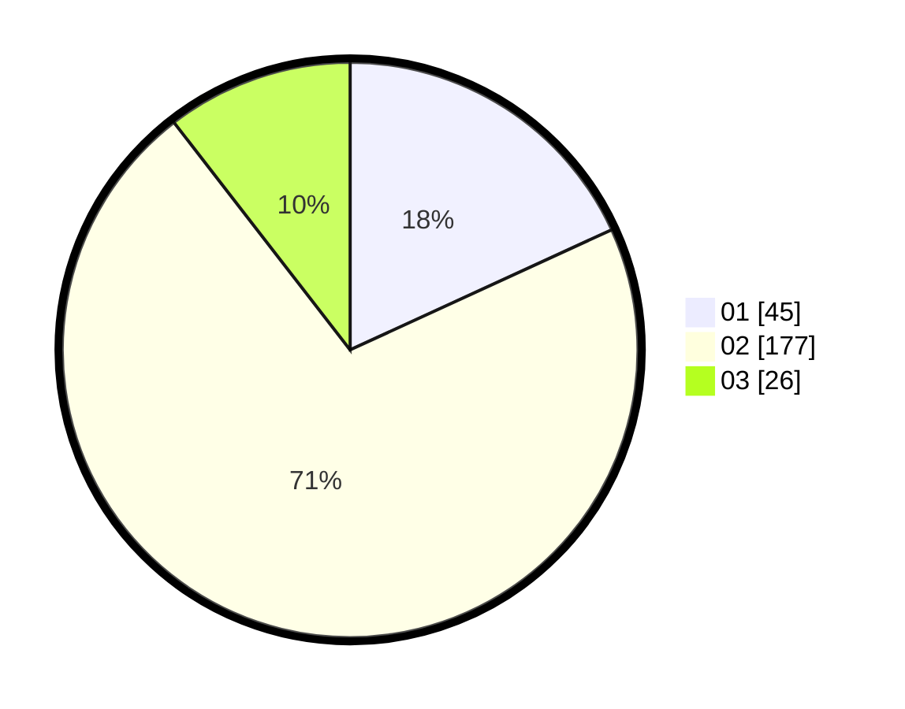

# Hasil

Hasil perolehan suara paslon dapat dilihat pada file paslon-01.txt, paslon-02.txt, dan paslon-03.txt.

Jika tidak ada, artinya data tersebut belum ada pada SIREKAP.

## Perolehan Suara

 * Paslon 01: **45**.
 * Paslon 02: **177**.
 * Paslon 03: **26**.

## Foto C Plano

https://sirekap-obj-formc.kpu.go.id/cafa/pemilu/ppwp/31/73/06/10/03/3173061003203-20240214-184715--e41f4239-a762-48c6-ac76-48ee5ca0c6fe.jpg

https://sirekap-obj-formc.kpu.go.id/cafa/pemilu/ppwp/31/73/06/10/03/3173061003203-20240214-191348--10187dc3-918f-4396-bd6d-93dcd03b03b6.jpg

https://sirekap-obj-formc.kpu.go.id/cafa/pemilu/ppwp/31/73/06/10/03/3173061003203-20240214-184607--70df6df3-1cdc-4f38-ba16-f4a5d8d7dde9.jpg

## DATA PEMILIH TETAP

Jumlah pemilih dalam DPT: **255**.
 * L: **132**.
 * P: **123**.

## DATA PENGGUNA HAK PILIH

Jumlah pengguna hak pilih dalam DPT: **155**.
 * L: **92**.
 * P: **71**.

Jumlah pengguna hak pilih dalam DPTb: **700**.
 * L: **0**.
 * P: **82**.

Jumlah pengguna hak pilih dalam DPK: **4**.
 * L: **2**.
 * P: **2**.

Jumlah pengguna hak pilih: **187**.
 * L: **94**.
 * P: **92**.

## JUMLAH SUARA SAH DAN TIDAK SAH

JUMLAH SELURUH SUARA SAH: **177**.

JUMLAH SUARA TIDAK SAH: **4**.

JUMLAH SELURUH SUARA SAH DAN SUARA TIDAK SAH: **547**.
