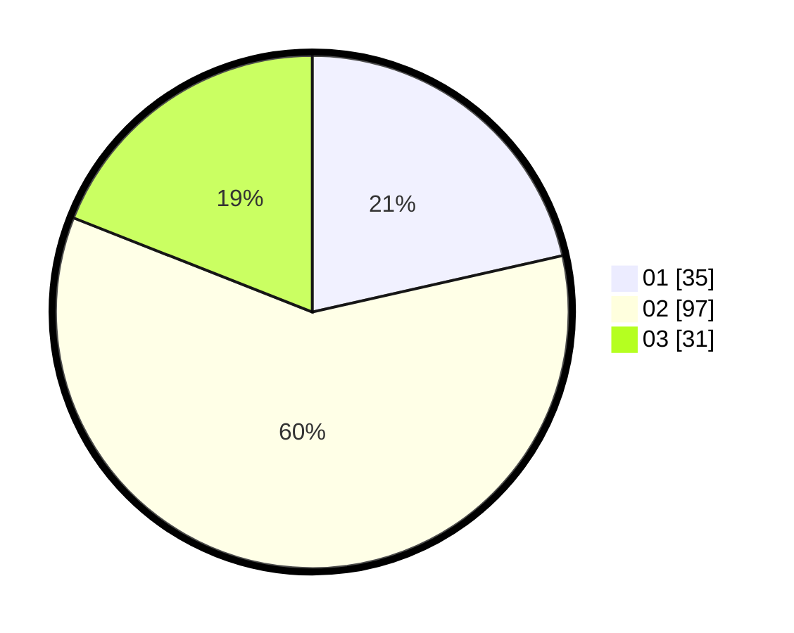

# Hasil

Hasil perolehan suara paslon dapat dilihat pada file paslon-01.txt, paslon-02.txt, dan paslon-03.txt.

Jika tidak ada, artinya data tersebut belum ada pada SIREKAP.

## Perolehan Suara

 * Paslon 01: **35**.
 * Paslon 02: **97**.
 * Paslon 03: **31**.

## Foto C Plano

https://sirekap-obj-formc.kpu.go.id/1149/pemilu/ppwp/31/73/06/10/03/3173061003207-20240215-004656--31d5b670-8d43-4b2a-b3b0-fe6c6690ba23.jpg

https://sirekap-obj-formc.kpu.go.id/1149/pemilu/ppwp/31/73/06/10/03/3173061003207-20240215-004710--7da32ab3-818d-4b09-bc74-e946ab6ec6fb.jpg

https://sirekap-obj-formc.kpu.go.id/1149/pemilu/ppwp/31/73/06/10/03/3173061003207-20240214-202311--3b341629-3cad-4499-8af1-d14a847bf696.jpg
