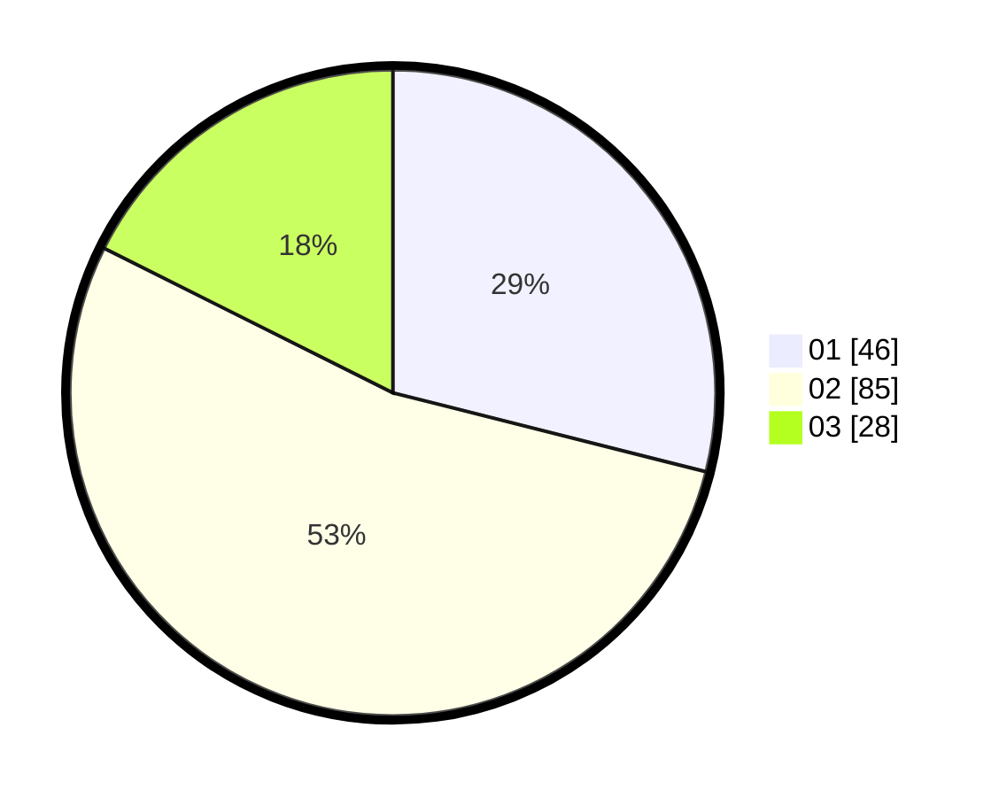

# Hasil

Hasil perolehan suara paslon dapat dilihat pada file paslon-01.txt, paslon-02.txt, dan paslon-03.txt.

Jika tidak ada, artinya data tersebut belum ada pada SIREKAP.

## Perolehan Suara

 * Paslon 01: **46**.
 * Paslon 02: **85**.
 * Paslon 03: **28**.

## Foto C Plano

https://sirekap-obj-formc.kpu.go.id/1300/pemilu/ppwp/31/73/06/10/03/3173061003208-20240214-200035--6ed8dabe-cbad-4e8d-8227-8fc24c6dd5ac.jpg

https://sirekap-obj-formc.kpu.go.id/1300/pemilu/ppwp/31/73/06/10/03/3173061003208-20240214-200242--0301677f-136a-485d-aa7d-82bb7bc7c40a.jpg

https://sirekap-obj-formc.kpu.go.id/1300/pemilu/ppwp/31/73/06/10/03/3173061003208-20240214-200339--5556078c-12fb-463b-889f-873a08d2ae35.jpg

## DATA PEMILIH TETAP

Jumlah pemilih dalam DPT: **229**.
 * L: **113**.
 * P: **116**.

## DATA PENGGUNA HAK PILIH

Jumlah pengguna hak pilih dalam DPT: **156**.
 * L: **70**.
 * P: **86**.

Jumlah pengguna hak pilih dalam DPTb: **2**.
 * L: **1**.
 * P: **1**.

Jumlah pengguna hak pilih dalam DPK: **3**.
 * L: **1**.
 * P: **2**.

Jumlah pengguna hak pilih: **161**.
 * L: **72**.
 * P: **89**.

## JUMLAH SUARA SAH DAN TIDAK SAH

JUMLAH SELURUH SUARA SAH: **159**.

JUMLAH SUARA TIDAK SAH: **2**.

JUMLAH SELURUH SUARA SAH DAN SUARA TIDAK SAH: **161**.
