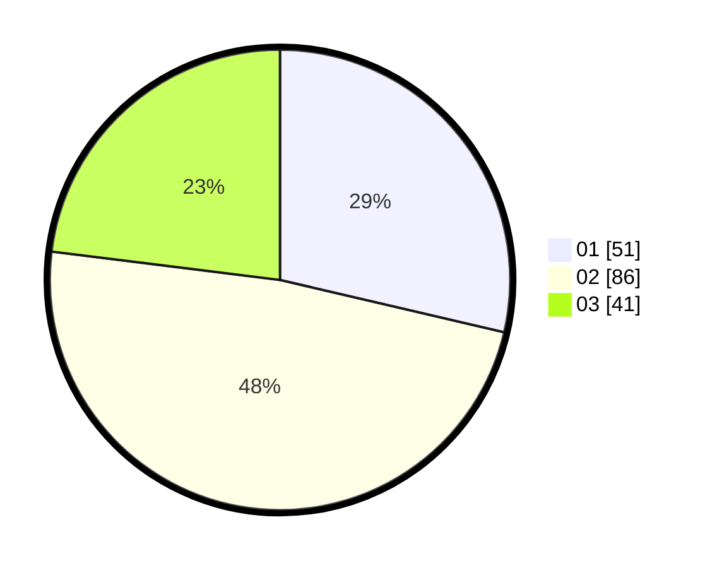

# Hasil

Hasil perolehan suara paslon dapat dilihat pada file paslon-01.txt, paslon-02.txt, dan paslon-03.txt.

Jika tidak ada, artinya data tersebut belum ada pada SIREKAP.

## Perolehan Suara

 * Paslon 01: **51**.
 * Paslon 02: **86**.
 * Paslon 03: **41**.

## Foto C Plano

https://sirekap-obj-formc.kpu.go.id/af01/pemilu/ppwp/31/73/06/10/03/3173061003209-20240214-225809--b64d1f09-9a98-410b-be5b-0e512721a1fe.jpg

https://sirekap-obj-formc.kpu.go.id/af01/pemilu/ppwp/31/73/06/10/03/3173061003209-20240214-225835--b8ef8713-4313-4c05-a0ac-a99e7907d922.jpg

https://sirekap-obj-formc.kpu.go.id/af01/pemilu/ppwp/31/73/06/10/03/3173061003209-20240214-225858--070b4f13-f797-434d-bc3b-cc0c2627c4f4.jpg
