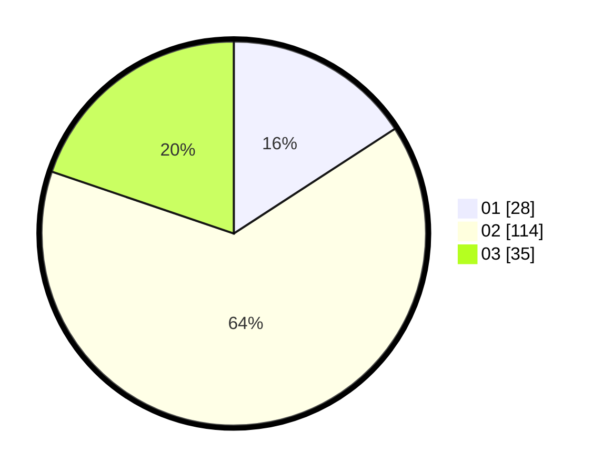

# Hasil

Hasil perolehan suara paslon dapat dilihat pada file paslon-01.txt, paslon-02.txt, dan paslon-03.txt.

Jika tidak ada, artinya data tersebut belum ada pada SIREKAP.

## Perolehan Suara

 * Paslon 01: **28**.
 * Paslon 02: **114**.
 * Paslon 03: **35**.

## Foto C Plano

https://sirekap-obj-formc.kpu.go.id/32e5/pemilu/ppwp/31/73/06/10/03/3173061003210-20240214-225817--4842f860-3fdd-4ece-97d9-c451c4383d45.jpg

https://sirekap-obj-formc.kpu.go.id/32e5/pemilu/ppwp/31/73/06/10/03/3173061003210-20240214-225913--7ab0a3e5-debd-458f-834c-30dcae292395.jpg
