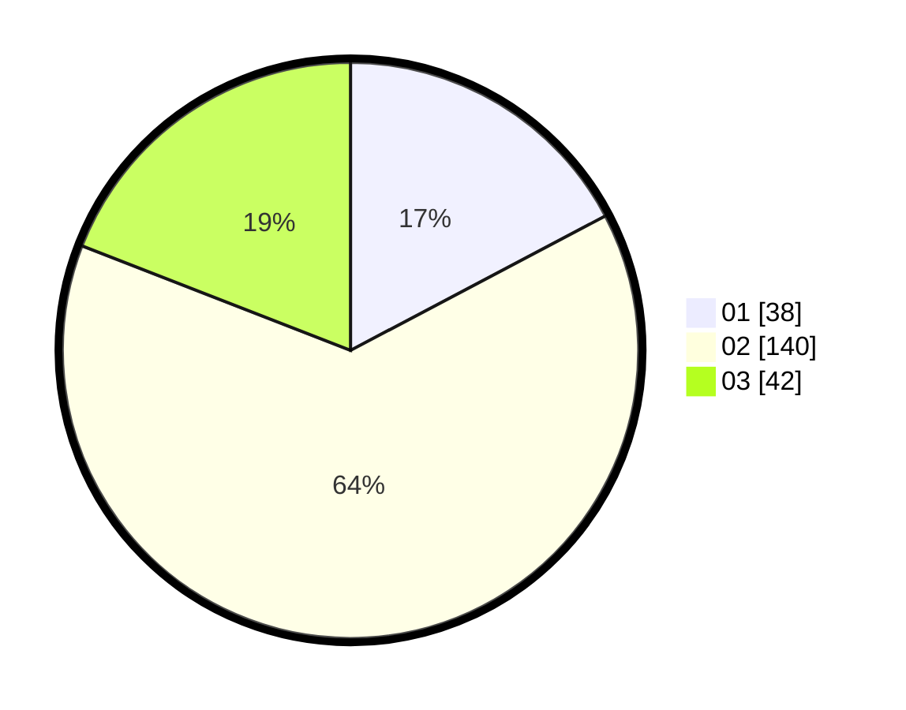

# Hasil

Hasil perolehan suara paslon dapat dilihat pada file paslon-01.txt, paslon-02.txt, dan paslon-03.txt.

Jika tidak ada, artinya data tersebut belum ada pada SIREKAP.

## Perolehan Suara

 * Paslon 01: **38**.
 * Paslon 02: **140**.
 * Paslon 03: **42**.

## Foto C Plano

https://sirekap-obj-formc.kpu.go.id/dc6a/pemilu/ppwp/31/73/06/10/03/3173061003215-20240214-224830--f2bf66f1-65ef-40e5-98f2-fa4f6abbde65.jpg

https://sirekap-obj-formc.kpu.go.id/dc6a/pemilu/ppwp/31/73/06/10/03/3173061003215-20240214-214006--2444fc40-3da9-4ba2-9276-0b2d0b2bf341.jpg

https://sirekap-obj-formc.kpu.go.id/dc6a/pemilu/ppwp/31/73/06/10/03/3173061003215-20240214-214230--c7ca3725-248b-4830-bd79-7249a2841e34.jpg
