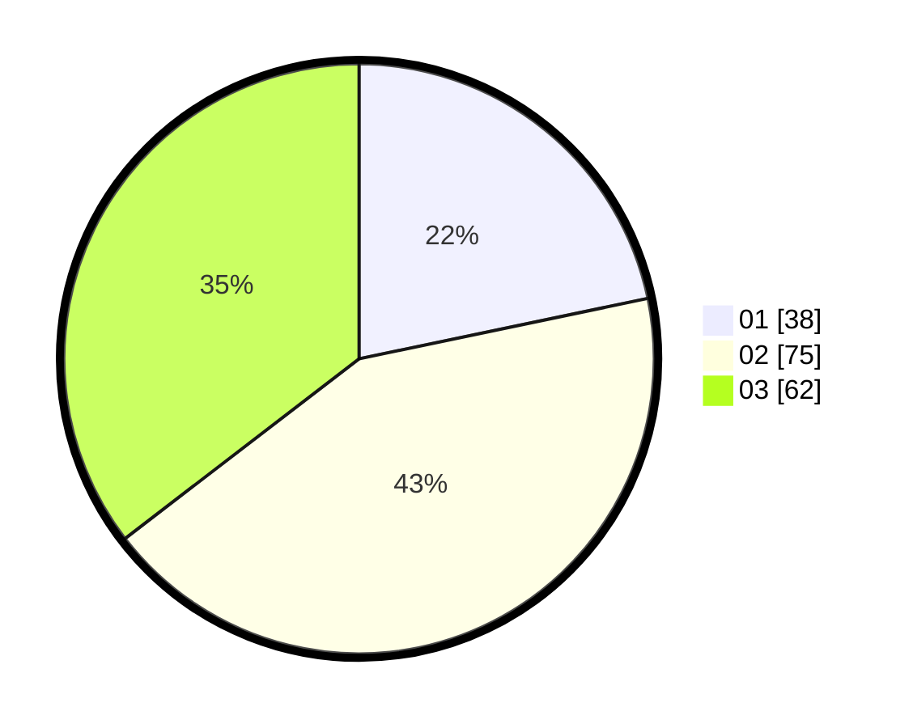

# Hasil

Hasil perolehan suara paslon dapat dilihat pada file paslon-01.txt, paslon-02.txt, dan paslon-03.txt.

Jika tidak ada, artinya data tersebut belum ada pada SIREKAP.

## Perolehan Suara

 * Paslon 01: **38**.
 * Paslon 02: **75**.
 * Paslon 03: **62**.

## Foto C Plano

https://sirekap-obj-formc.kpu.go.id/7e8e/pemilu/ppwp/31/73/06/10/03/3173061003216-20240214-222358--fa8715f9-943e-425d-a594-775b687a622b.jpg

https://sirekap-obj-formc.kpu.go.id/7e8e/pemilu/ppwp/31/73/06/10/03/3173061003216-20240214-222604--4e23bc44-abb4-425b-be3e-445eba7fd671.jpg

https://sirekap-obj-formc.kpu.go.id/7e8e/pemilu/ppwp/31/73/06/10/03/3173061003216-20240214-222737--911cf097-cce5-441b-99cb-82972fe1e3a6.jpg
