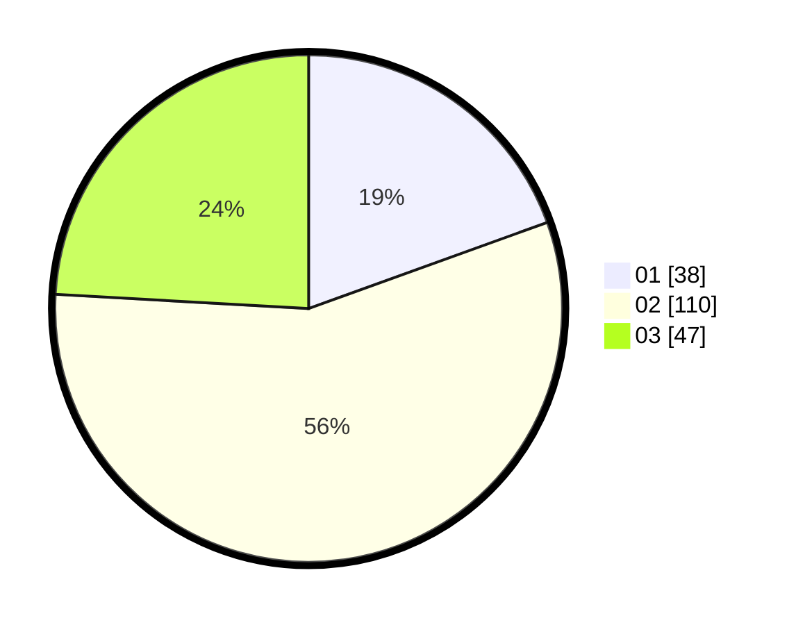

# Hasil

Hasil perolehan suara paslon dapat dilihat pada file paslon-01.txt, paslon-02.txt, dan paslon-03.txt.

Jika tidak ada, artinya data tersebut belum ada pada SIREKAP.

## Perolehan Suara

 * Paslon 01: **38**.
 * Paslon 02: **110**.
 * Paslon 03: **47**.

## Foto C Plano

https://sirekap-obj-formc.kpu.go.id/f7a9/pemilu/ppwp/31/73/06/10/03/3173061003217-20240214-204012--819333fb-cb7c-4c0c-a375-a4c2096b64b5.jpg

https://sirekap-obj-formc.kpu.go.id/f7a9/pemilu/ppwp/31/73/06/10/03/3173061003217-20240214-193634--261468e4-12d1-40df-b297-b976f145a878.jpg

https://sirekap-obj-formc.kpu.go.id/f7a9/pemilu/ppwp/31/73/06/10/03/3173061003217-20240214-193651--98b5870a-73ac-44e1-9f9c-f546cfae6d16.jpg

## DATA PEMILIH TETAP

Jumlah pemilih dalam DPT: **243**.
 * L: **113**.
 * P: **130**.

## DATA PENGGUNA HAK PILIH

Jumlah pengguna hak pilih dalam DPT: **196**.
 * L: **88**.
 * P: **108**.

Jumlah pengguna hak pilih dalam DPTb: **0**.
 * L: **0**.
 * P: **0**.

Jumlah pengguna hak pilih dalam DPK: **2**.
 * L: **2**.
 * P: **0**.

Jumlah pengguna hak pilih: **198**.
 * L: **90**.
 * P: **108**.

## JUMLAH SUARA SAH DAN TIDAK SAH

JUMLAH SELURUH SUARA SAH: **195**.

JUMLAH SUARA TIDAK SAH: **3**.

JUMLAH SELURUH SUARA SAH DAN SUARA TIDAK SAH: **198**.
