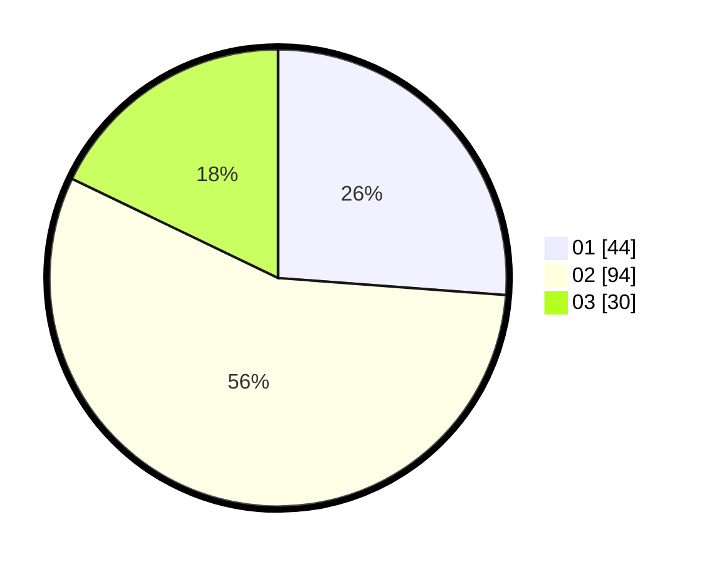

# Hasil

Hasil perolehan suara paslon dapat dilihat pada file paslon-01.txt, paslon-02.txt, dan paslon-03.txt.

Jika tidak ada, artinya data tersebut belum ada pada SIREKAP.

## Perolehan Suara

 * Paslon 01: **44**.
 * Paslon 02: **94**.
 * Paslon 03: **30**.

## Foto C Plano

https://sirekap-obj-formc.kpu.go.id/f01a/pemilu/ppwp/31/73/06/10/03/3173061003218-20240215-101743--e5f54cac-f7c6-427a-9074-ef0a5f08cf5b.jpg

https://sirekap-obj-formc.kpu.go.id/f01a/pemilu/ppwp/31/73/06/10/03/3173061003218-20240214-232019--0951a637-7a16-41e4-9bf8-8f1f9135f218.jpg

https://sirekap-obj-formc.kpu.go.id/f01a/pemilu/ppwp/31/73/06/10/03/3173061003218-20240214-232149--ce6da34c-04ad-4ca4-9edb-6f3b0beffe3f.jpg
