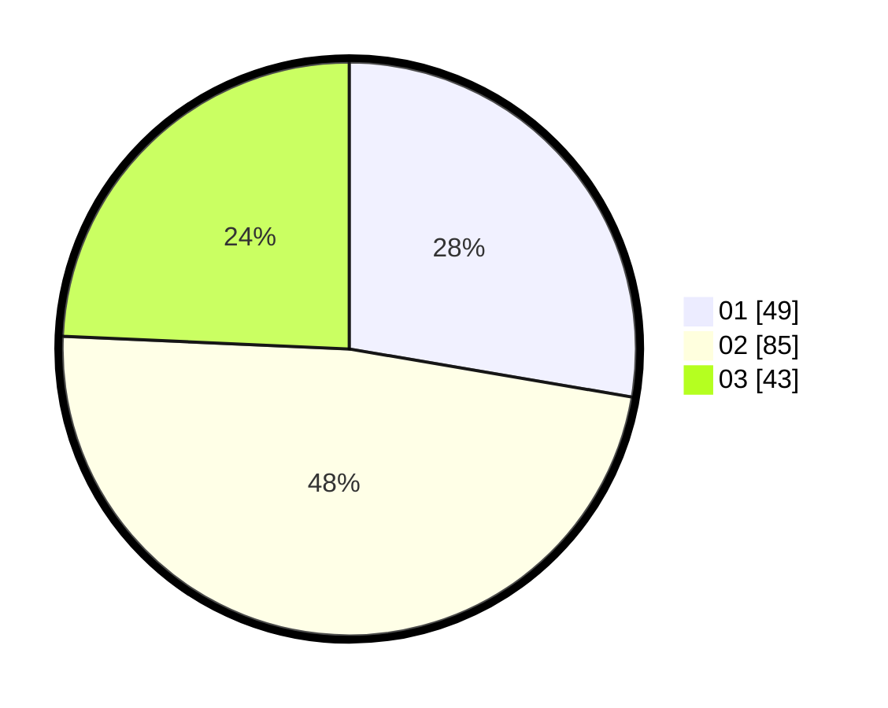

# Hasil

Hasil perolehan suara paslon dapat dilihat pada file paslon-01.txt, paslon-02.txt, dan paslon-03.txt.

Jika tidak ada, artinya data tersebut belum ada pada SIREKAP.

## Perolehan Suara

 * Paslon 01: **49**.
 * Paslon 02: **85**.
 * Paslon 03: **43**.

## Foto C Plano

https://sirekap-obj-formc.kpu.go.id/69f1/pemilu/ppwp/31/73/06/10/03/3173061003219-20240214-202701--1c22fb12-14a0-4100-99c6-b94ce7afb282.jpg

https://sirekap-obj-formc.kpu.go.id/69f1/pemilu/ppwp/31/73/06/10/03/3173061003219-20240214-212138--b8c81922-d8e7-4b3c-b630-daedf2f16076.jpg

https://sirekap-obj-formc.kpu.go.id/69f1/pemilu/ppwp/31/73/06/10/03/3173061003219-20240214-204300--e8632b58-8cd8-4c3d-9604-9d06b2d3ad92.jpg

## DATA PEMILIH TETAP

Jumlah pemilih dalam DPT: **246**.
 * L: **116**.
 * P: **130**.

## DATA PENGGUNA HAK PILIH

Jumlah pengguna hak pilih dalam DPT: **180**.
 * L: **77**.
 * P: **103**.

Jumlah pengguna hak pilih dalam DPTb: **0**.
 * L: **0**.
 * P: **0**.

Jumlah pengguna hak pilih dalam DPK: **3**.
 * L: **1**.
 * P: **2**.

Jumlah pengguna hak pilih: **183**.
 * L: **78**.
 * P: **105**.

## JUMLAH SUARA SAH DAN TIDAK SAH

JUMLAH SELURUH SUARA SAH: **177**.

JUMLAH SUARA TIDAK SAH: **6**.

JUMLAH SELURUH SUARA SAH DAN SUARA TIDAK SAH: **183**.
