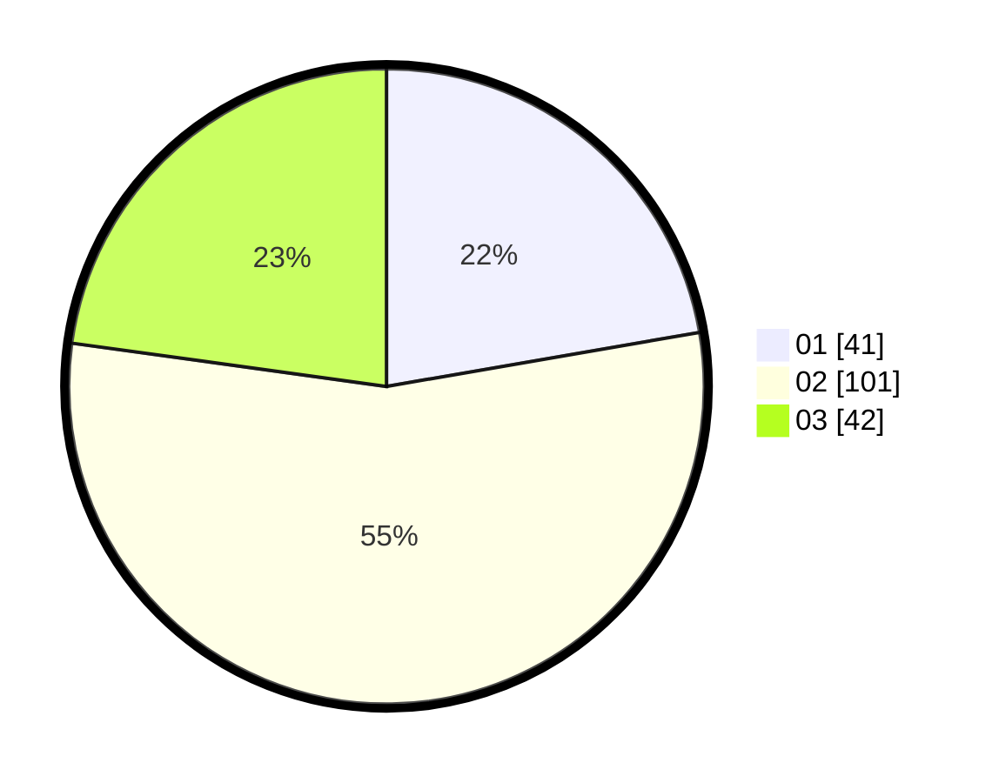

# Hasil

Hasil perolehan suara paslon dapat dilihat pada file paslon-01.txt, paslon-02.txt, dan paslon-03.txt.

Jika tidak ada, artinya data tersebut belum ada pada SIREKAP.

## Perolehan Suara

 * Paslon 01: **41**.
 * Paslon 02: **101**.
 * Paslon 03: **42**.

## Foto C Plano

https://sirekap-obj-formc.kpu.go.id/bb88/pemilu/ppwp/31/73/06/10/03/3173061003221-20240216-061331--af0ffd70-36d3-49e1-b047-e0e04aeb4f06.jpg

https://sirekap-obj-formc.kpu.go.id/bb88/pemilu/ppwp/31/73/06/10/03/3173061003221-20240216-061333--d3ae589e-1b8e-42d9-9f16-46d6222fc5a0.jpg

https://sirekap-obj-formc.kpu.go.id/bb88/pemilu/ppwp/31/73/06/10/03/3173061003221-20240216-061332--f4c77f8a-eb5b-41ea-828d-abe0c49b5b57.jpg

## DATA PEMILIH TETAP

Jumlah pemilih dalam DPT: **255**.
 * L: **122**.
 * P: **133**.

## DATA PENGGUNA HAK PILIH

Jumlah pengguna hak pilih dalam DPT: **181**.
 * L: **81**.
 * P: **100**.

Jumlah pengguna hak pilih dalam DPTb: **0**.
 * L: **0**.
 * P: **0**.

Jumlah pengguna hak pilih dalam DPK: **4**.
 * L: **2**.
 * P: **2**.

Jumlah pengguna hak pilih: **185**.
 * L: **83**.
 * P: **102**.

## JUMLAH SUARA SAH DAN TIDAK SAH

JUMLAH SELURUH SUARA SAH: **184**.

JUMLAH SUARA TIDAK SAH: **1**.

JUMLAH SELURUH SUARA SAH DAN SUARA TIDAK SAH: **185**.
