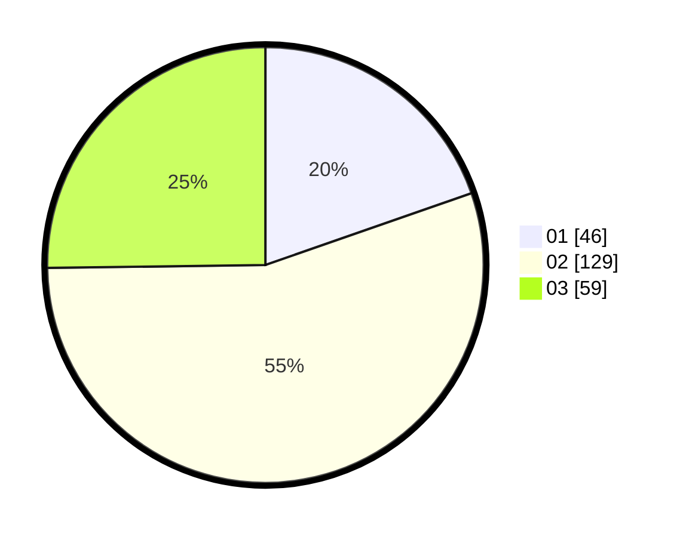

# Hasil

Hasil perolehan suara paslon dapat dilihat pada file paslon-01.txt, paslon-02.txt, dan paslon-03.txt.

Jika tidak ada, artinya data tersebut belum ada pada SIREKAP.

## Perolehan Suara

 * Paslon 01: **46**.
 * Paslon 02: **129**.
 * Paslon 03: **59**.

## Foto C Plano

https://sirekap-obj-formc.kpu.go.id/966e/pemilu/ppwp/31/73/06/10/03/3173061003225-20240214-190042--fb75fbb5-e767-455e-978d-702d0f752ba6.jpg

https://sirekap-obj-formc.kpu.go.id/966e/pemilu/ppwp/31/73/06/10/03/3173061003225-20240214-190053--4242d16d-0dbe-4fd5-ac07-69c8a4aff191.jpg

https://sirekap-obj-formc.kpu.go.id/966e/pemilu/ppwp/31/73/06/10/03/3173061003225-20240214-190056--65fc9fc7-31f3-4a14-86c2-683c7f16fc6c.jpg

## DATA PEMILIH TETAP

Jumlah pemilih dalam DPT: **295**.
 * L: **145**.
 * P: **150**.

## DATA PENGGUNA HAK PILIH

Jumlah pengguna hak pilih dalam DPT: **231**.
 * L: **105**.
 * P: **126**.

Jumlah pengguna hak pilih dalam DPTb: **0**.
 * L: **0**.
 * P: **0**.

Jumlah pengguna hak pilih dalam DPK: **5**.
 * L: **2**.
 * P: **3**.

Jumlah pengguna hak pilih: **236**.
 * L: **107**.
 * P: **129**.

## JUMLAH SUARA SAH DAN TIDAK SAH

JUMLAH SELURUH SUARA SAH: **234**.

JUMLAH SUARA TIDAK SAH: **2**.

JUMLAH SELURUH SUARA SAH DAN SUARA TIDAK SAH: **236**.
