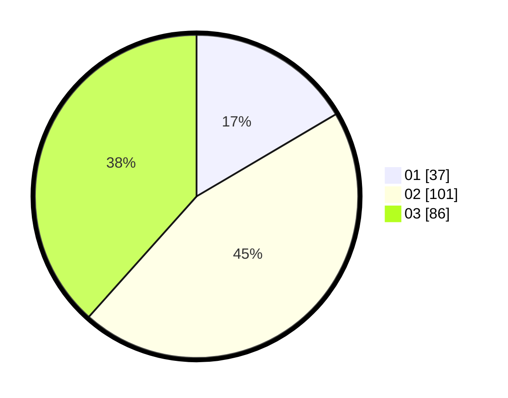

# Hasil

Hasil perolehan suara paslon dapat dilihat pada file paslon-01.txt, paslon-02.txt, dan paslon-03.txt.

Jika tidak ada, artinya data tersebut belum ada pada SIREKAP.

## Perolehan Suara

 * Paslon 01: **37**.
 * Paslon 02: **101**.
 * Paslon 03: **86**.

## Foto C Plano

https://sirekap-obj-formc.kpu.go.id/6cb3/pemilu/ppwp/31/73/06/10/03/3173061003226-20240214-185403--ade80a77-7dc6-4268-92da-112435bf52eb.jpg

https://sirekap-obj-formc.kpu.go.id/6cb3/pemilu/ppwp/31/73/06/10/03/3173061003226-20240217-200558--fa9a2b63-df67-4b81-88e9-aaa69a01b34a.jpg

https://sirekap-obj-formc.kpu.go.id/6cb3/pemilu/ppwp/31/73/06/10/03/3173061003226-20240214-220836--13768c0a-9ce9-4663-82dc-4d7d7b38ff73.jpg

## DATA PEMILIH TETAP

Jumlah pemilih dalam DPT: **293**.
 * L: **145**.
 * P: **148**.

## DATA PENGGUNA HAK PILIH

Jumlah pengguna hak pilih dalam DPT: **227**.
 * L: **104**.
 * P: **123**.

Jumlah pengguna hak pilih dalam DPTb: **1**.
 * L: **1**.
 * P: **0**.

Jumlah pengguna hak pilih dalam DPK: **0**.
 * L: **0**.
 * P: **0**.

Jumlah pengguna hak pilih: **228**.
 * L: **105**.
 * P: **123**.

## JUMLAH SUARA SAH DAN TIDAK SAH

JUMLAH SELURUH SUARA SAH: **224**.

JUMLAH SUARA TIDAK SAH: **4**.

JUMLAH SELURUH SUARA SAH DAN SUARA TIDAK SAH: **228**.
