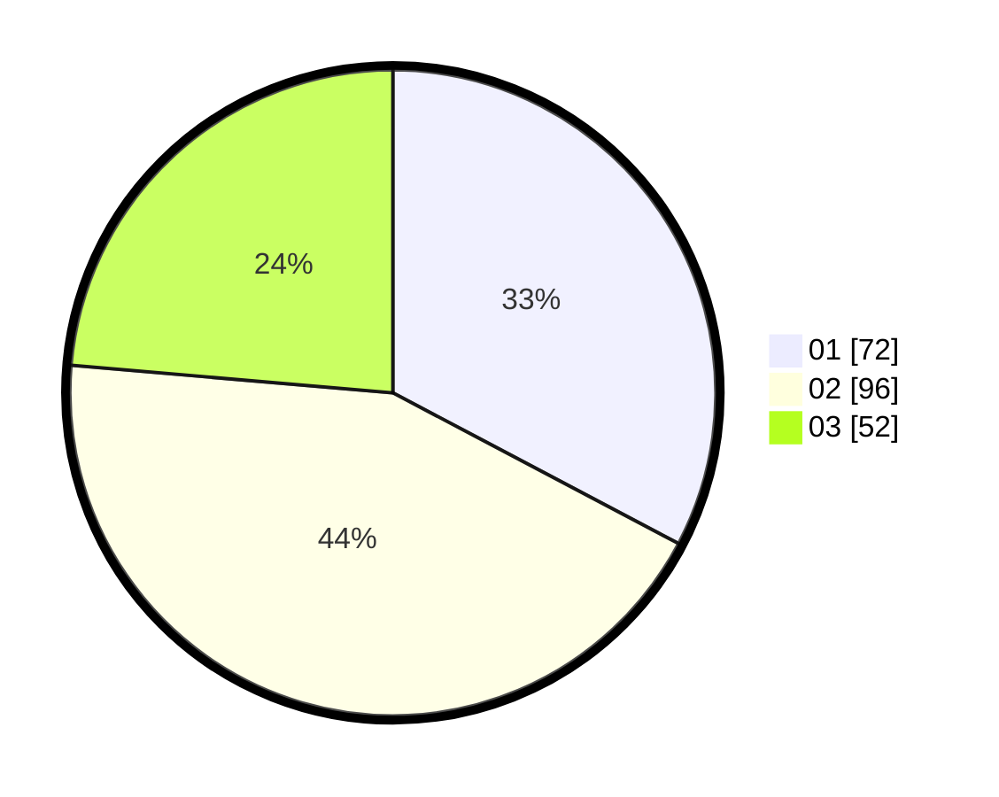

# Hasil

Hasil perolehan suara paslon dapat dilihat pada file paslon-01.txt, paslon-02.txt, dan paslon-03.txt.

Jika tidak ada, artinya data tersebut belum ada pada SIREKAP.

## Perolehan Suara

 * Paslon 01: **72**.
 * Paslon 02: **96**.
 * Paslon 03: **52**.

## Foto C Plano

https://sirekap-obj-formc.kpu.go.id/1b4c/pemilu/ppwp/31/73/06/10/03/3173061003227-20240214-221838--9820030c-ef82-4424-847f-d96a6fc8fac8.jpg

https://sirekap-obj-formc.kpu.go.id/1b4c/pemilu/ppwp/31/73/06/10/03/3173061003227-20240214-233900--4c39f858-c829-44c0-9356-349b4a3ad592.jpg

https://sirekap-obj-formc.kpu.go.id/1b4c/pemilu/ppwp/31/73/06/10/03/3173061003227-20240214-222628--3a64ebec-cfe5-46a6-8b1e-b0f1cedc80dc.jpg
