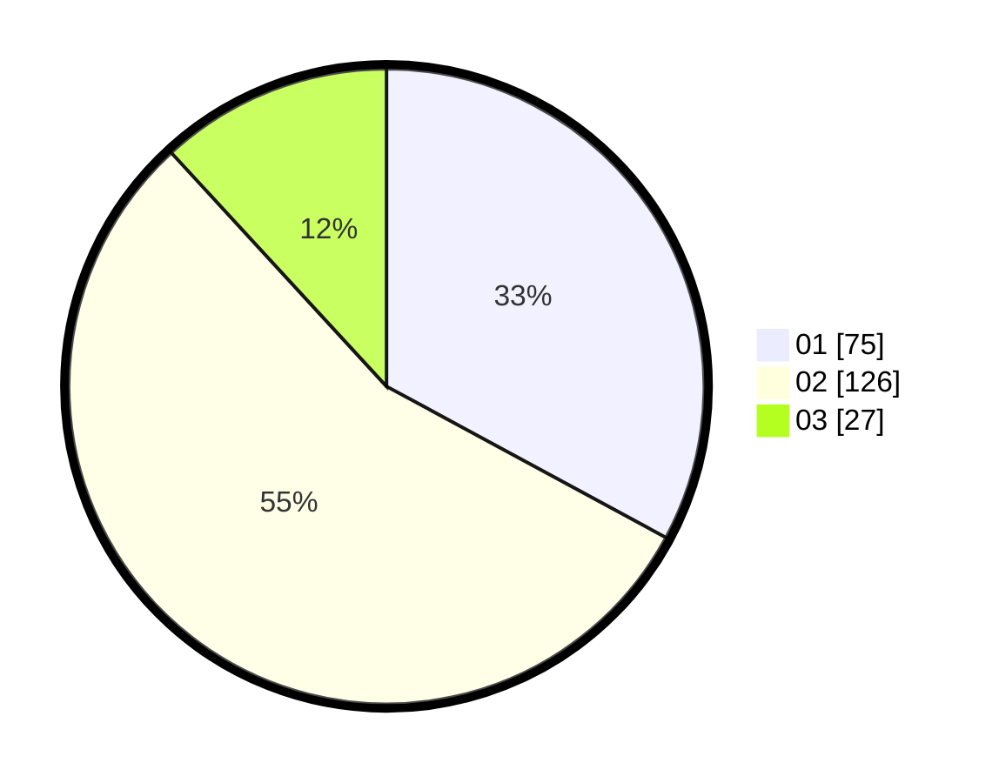

# Hasil

Hasil perolehan suara paslon dapat dilihat pada file paslon-01.txt, paslon-02.txt, dan paslon-03.txt.

Jika tidak ada, artinya data tersebut belum ada pada SIREKAP.

## Perolehan Suara

 * Paslon 01: **75**.
 * Paslon 02: **126**.
 * Paslon 03: **27**.

## Foto C Plano

https://sirekap-obj-formc.kpu.go.id/cb33/pemilu/ppwp/31/73/06/10/03/3173061003239-20240214-212809--3e6d2142-f1bc-4b7e-8436-6a506cc60600.jpg

https://sirekap-obj-formc.kpu.go.id/cb33/pemilu/ppwp/31/73/06/10/03/3173061003239-20240214-211044--d68a0011-c87e-4f54-bf2b-535ee5b2cd91.jpg

https://sirekap-obj-formc.kpu.go.id/cb33/pemilu/ppwp/31/73/06/10/03/3173061003239-20240214-212954--8a2cae05-8e9c-4342-ab1c-4ff6f3b8bb34.jpg
