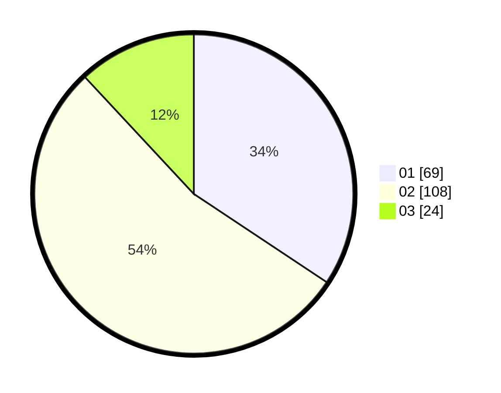

# Hasil

Hasil perolehan suara paslon dapat dilihat pada file paslon-01.txt, paslon-02.txt, dan paslon-03.txt.

Jika tidak ada, artinya data tersebut belum ada pada SIREKAP.

## Perolehan Suara

 * Paslon 01: **69**.
 * Paslon 02: **108**.
 * Paslon 03: **24**.

## Foto C Plano

https://sirekap-obj-formc.kpu.go.id/5a80/pemilu/ppwp/31/73/06/10/03/3173061003240-20240214-214743--586c6de2-39ff-40dc-9450-7e2fbffbcf09.jpg

https://sirekap-obj-formc.kpu.go.id/5a80/pemilu/ppwp/31/73/06/10/03/3173061003240-20240214-214950--bdf00d47-5691-4839-950b-8c06c22e3b21.jpg

https://sirekap-obj-formc.kpu.go.id/5a80/pemilu/ppwp/31/73/06/10/03/3173061003240-20240214-215204--42547b56-4cfc-4445-92ef-0b49ce0d4956.jpg

## DATA PEMILIH TETAP

Jumlah pemilih dalam DPT: **290**.
 * L: **147**.
 * P: **143**.

## DATA PENGGUNA HAK PILIH

Jumlah pengguna hak pilih dalam DPT: **206**.
 * L: **104**.
 * P: **102**.

Jumlah pengguna hak pilih dalam DPTb: **0**.
 * L: **0**.
 * P: **0**.

Jumlah pengguna hak pilih dalam DPK: **0**.
 * L: **0**.
 * P: **0**.

Jumlah pengguna hak pilih: **206**.
 * L: **104**.
 * P: **102**.

## JUMLAH SUARA SAH DAN TIDAK SAH

JUMLAH SELURUH SUARA SAH: **201**.

JUMLAH SUARA TIDAK SAH: **5**.

JUMLAH SELURUH SUARA SAH DAN SUARA TIDAK SAH: **206**.
