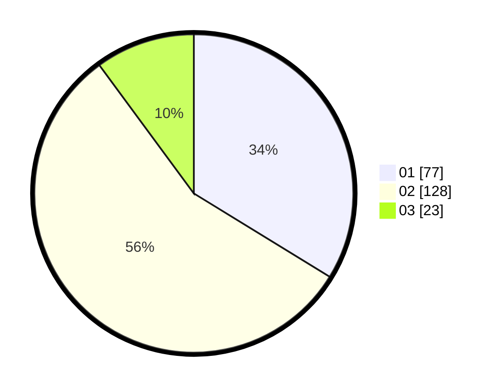

# Hasil

Hasil perolehan suara paslon dapat dilihat pada file paslon-01.txt, paslon-02.txt, dan paslon-03.txt.

Jika tidak ada, artinya data tersebut belum ada pada SIREKAP.

## Perolehan Suara

 * Paslon 01: **77**.
 * Paslon 02: **128**.
 * Paslon 03: **23**.

## Foto C Plano

https://sirekap-obj-formc.kpu.go.id/e9d6/pemilu/ppwp/31/73/06/10/03/3173061003243-20240215-004051--19303cc8-983a-423e-8bd5-1fa6a1bfeaae.jpg

https://sirekap-obj-formc.kpu.go.id/e9d6/pemilu/ppwp/31/73/06/10/03/3173061003243-20240215-011848--aaaaa2f1-d550-4fa5-9a39-e823b956ee9d.jpg

https://sirekap-obj-formc.kpu.go.id/e9d6/pemilu/ppwp/31/73/06/10/03/3173061003243-20240215-012101--1ab5c25c-4346-4e54-b037-698c7addb04d.jpg
