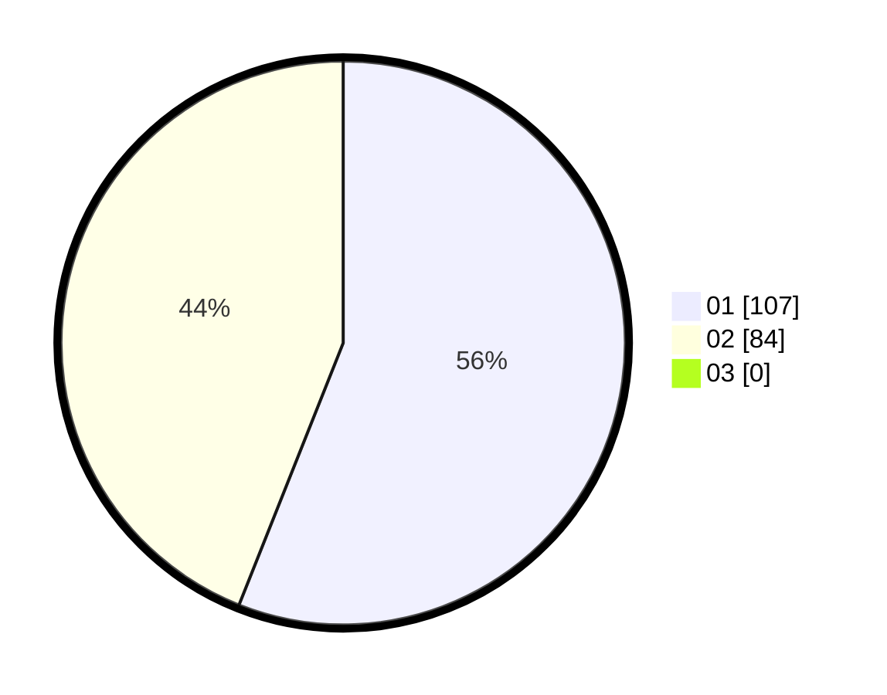

# Hasil

Hasil perolehan suara paslon dapat dilihat pada file paslon-01.txt, paslon-02.txt, dan paslon-03.txt.

Jika tidak ada, artinya data tersebut belum ada pada SIREKAP.

## Perolehan Suara

 * Paslon 01: **107**.
 * Paslon 02: **84**.
 * Paslon 03: **0**.

## Foto C Plano

https://sirekap-obj-formc.kpu.go.id/4ea4/pemilu/ppwp/31/73/06/10/03/3173061003247-20240214-211806--01b00f7b-8903-4cc9-9d44-6470f8e46f91.jpg

https://sirekap-obj-formc.kpu.go.id/4ea4/pemilu/ppwp/31/73/06/10/03/3173061003247-20240214-203434--beb6e930-fcce-4dcf-ae81-45d0aa6ce348.jpg

https://sirekap-obj-formc.kpu.go.id/4ea4/pemilu/ppwp/31/73/06/10/03/3173061003247-20240214-203632--be65bc37-05eb-4066-b742-b9ce07fa9b17.jpg

## DATA PEMILIH TETAP

Jumlah pemilih dalam DPT: **272**.
 * L: **141**.
 * P: **131**.

## DATA PENGGUNA HAK PILIH

Jumlah pengguna hak pilih dalam DPT: **219**.
 * L: **111**.
 * P: **108**.

Jumlah pengguna hak pilih dalam DPTb: **0**.
 * L: **0**.
 * P: **0**.

Jumlah pengguna hak pilih dalam DPK: **1**.
 * L: **0**.
 * P: **1**.

Jumlah pengguna hak pilih: **220**.
 * L: **111**.
 * P: **109**.

## JUMLAH SUARA SAH DAN TIDAK SAH

JUMLAH SELURUH SUARA SAH: **216**.

JUMLAH SUARA TIDAK SAH: **4**.

JUMLAH SELURUH SUARA SAH DAN SUARA TIDAK SAH: **220**.
