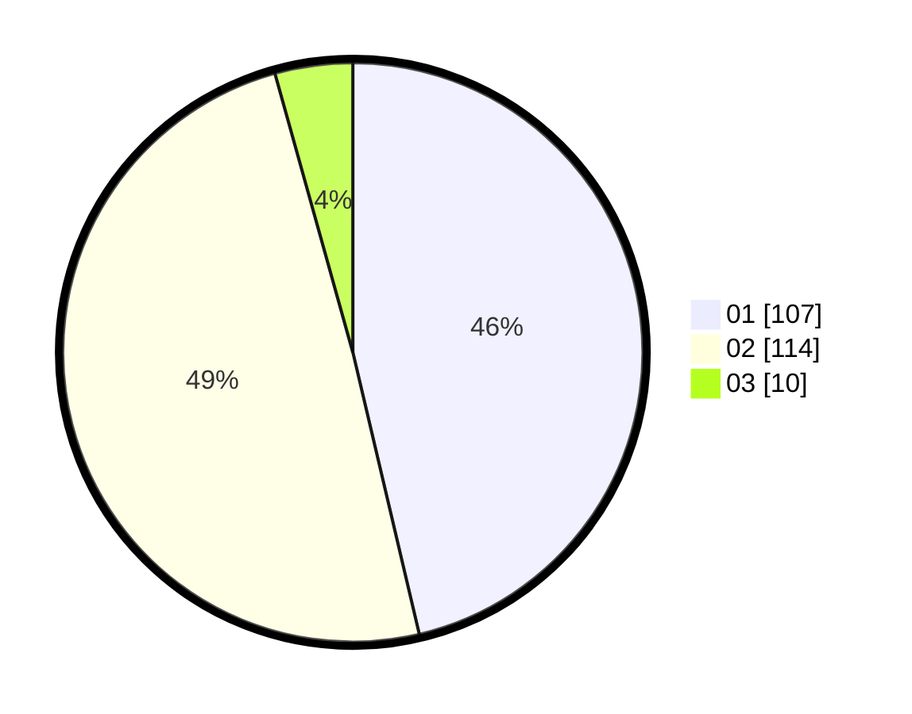

# Hasil

Hasil perolehan suara paslon dapat dilihat pada file paslon-01.txt, paslon-02.txt, dan paslon-03.txt.

Jika tidak ada, artinya data tersebut belum ada pada SIREKAP.

## Perolehan Suara

 * Paslon 01: **107**.
 * Paslon 02: **114**.
 * Paslon 03: **10**.

## Foto C Plano

https://sirekap-obj-formc.kpu.go.id/bd00/pemilu/ppwp/31/73/06/10/03/3173061003249-20240215-013035--a727a732-59ed-4568-aa0d-92c61584ebd6.jpg

https://sirekap-obj-formc.kpu.go.id/bd00/pemilu/ppwp/31/73/06/10/03/3173061003249-20240215-021327--86d30bfc-7be3-42bc-b01c-5c41fdb88427.jpg

https://sirekap-obj-formc.kpu.go.id/bd00/pemilu/ppwp/31/73/06/10/03/3173061003249-20240215-021419--e7a7d28f-1d25-4364-9669-df6d4aaabb8d.jpg
