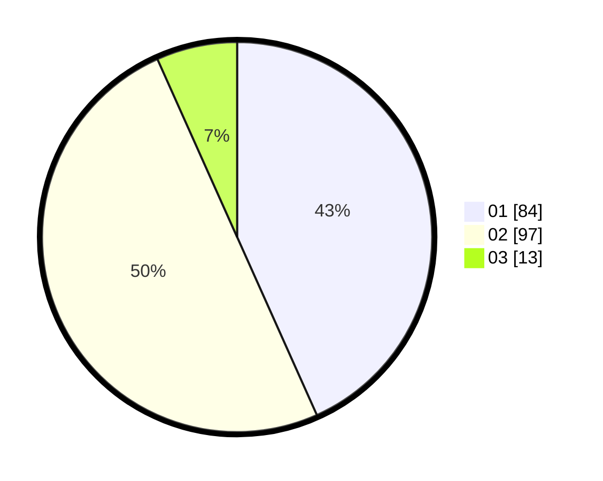

# Hasil

Hasil perolehan suara paslon dapat dilihat pada file paslon-01.txt, paslon-02.txt, dan paslon-03.txt.

Jika tidak ada, artinya data tersebut belum ada pada SIREKAP.

## Perolehan Suara

 * Paslon 01: **84**.
 * Paslon 02: **97**.
 * Paslon 03: **13**.

## Foto C Plano

https://sirekap-obj-formc.kpu.go.id/a8b9/pemilu/ppwp/31/73/06/10/03/3173061003251-20240215-211904--12f39e15-b1e6-4cbe-b559-fac2dbd1a753.jpg

https://sirekap-obj-formc.kpu.go.id/a8b9/pemilu/ppwp/31/73/06/10/03/3173061003251-20240215-211907--794173bb-51af-4ca6-a029-8b9ff4200f02.jpg

https://sirekap-obj-formc.kpu.go.id/a8b9/pemilu/ppwp/31/73/06/10/03/3173061003251-20240215-211905--3cc895ed-aadf-4d17-936e-e41560e9c793.jpg

## DATA PEMILIH TETAP

Jumlah pemilih dalam DPT: **270**.
 * L: **135**.
 * P: **135**.

## DATA PENGGUNA HAK PILIH

Jumlah pengguna hak pilih dalam DPT: **195**.
 * L: **94**.
 * P: **101**.

Jumlah pengguna hak pilih dalam DPTb: **2**.
 * L: **1**.
 * P: **1**.

Jumlah pengguna hak pilih dalam DPK: **0**.
 * L: **0**.
 * P: **0**.

Jumlah pengguna hak pilih: **197**.
 * L: **95**.
 * P: **102**.

## JUMLAH SUARA SAH DAN TIDAK SAH

JUMLAH SELURUH SUARA SAH: **194**.

JUMLAH SUARA TIDAK SAH: **3**.

JUMLAH SELURUH SUARA SAH DAN SUARA TIDAK SAH: **197**.
