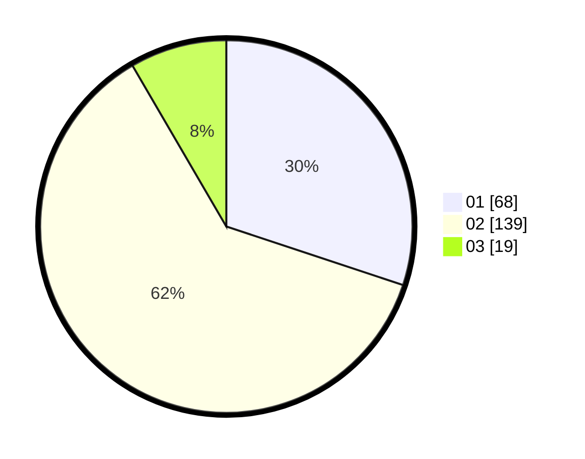

# Hasil

Hasil perolehan suara paslon dapat dilihat pada file paslon-01.txt, paslon-02.txt, dan paslon-03.txt.

Jika tidak ada, artinya data tersebut belum ada pada SIREKAP.

## Perolehan Suara

 * Paslon 01: **68**.
 * Paslon 02: **139**.
 * Paslon 03: **19**.

## Foto C Plano

https://sirekap-obj-formc.kpu.go.id/b390/pemilu/ppwp/31/73/06/10/03/3173061003252-20240214-224703--551eb068-2e83-4e10-bb53-4ce7c46515da.jpg

https://sirekap-obj-formc.kpu.go.id/b390/pemilu/ppwp/31/73/06/10/03/3173061003252-20240214-225239--ce8adfe9-850a-4c26-bef8-27d177e1012c.jpg

https://sirekap-obj-formc.kpu.go.id/b390/pemilu/ppwp/31/73/06/10/03/3173061003252-20240214-225454--694a17df-37ec-445d-baf2-5b9af4bc2082.jpg
