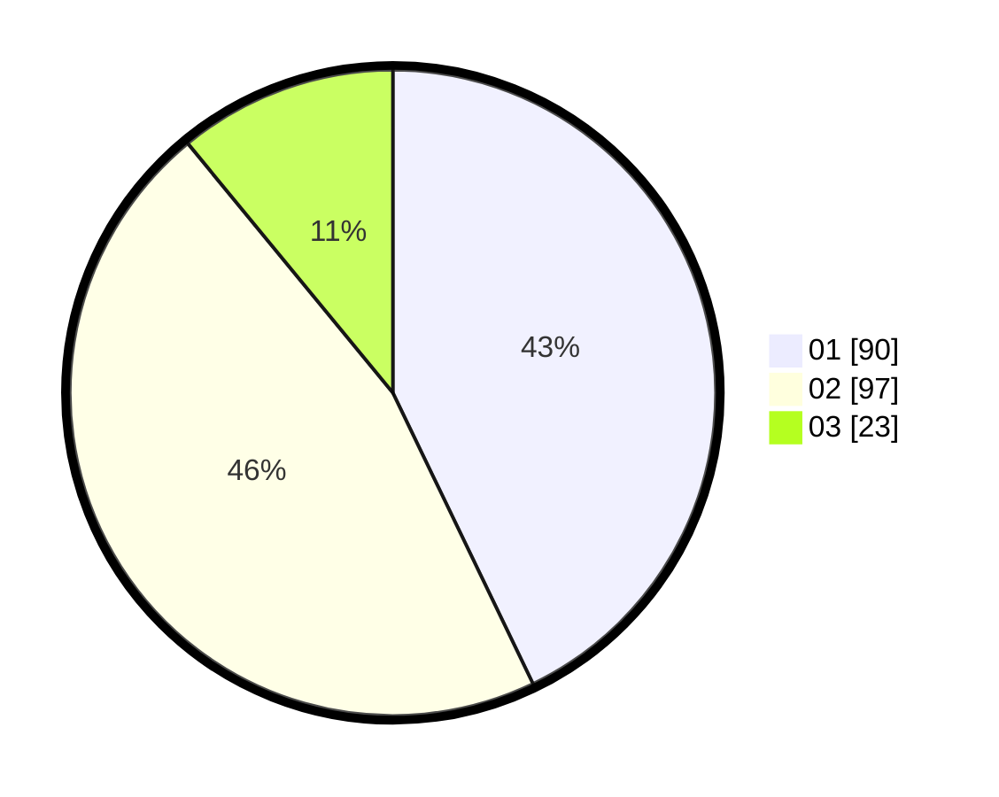

# Hasil

Hasil perolehan suara paslon dapat dilihat pada file paslon-01.txt, paslon-02.txt, dan paslon-03.txt.

Jika tidak ada, artinya data tersebut belum ada pada SIREKAP.

## Perolehan Suara

 * Paslon 01: **90**.
 * Paslon 02: **97**.
 * Paslon 03: **23**.

## Foto C Plano

https://sirekap-obj-formc.kpu.go.id/62d3/pemilu/ppwp/31/73/06/10/03/3173061003262-20240214-191535--40031c65-6aed-4955-abfa-b3ca12739e3c.jpg

https://sirekap-obj-formc.kpu.go.id/62d3/pemilu/ppwp/31/73/06/10/03/3173061003262-20240214-193140--e0ccb165-e597-4b3d-9906-e8894fd27c89.jpg

https://sirekap-obj-formc.kpu.go.id/62d3/pemilu/ppwp/31/73/06/10/03/3173061003262-20240214-191627--18892bc7-72ca-402b-b737-a68ddf4f5313.jpg

## DATA PEMILIH TETAP

Jumlah pemilih dalam DPT: **261**.
 * L: **134**.
 * P: **127**.

## DATA PENGGUNA HAK PILIH

Jumlah pengguna hak pilih dalam DPT: **214**.
 * L: **109**.
 * P: **105**.

Jumlah pengguna hak pilih dalam DPTb: **0**.
 * L: **0**.
 * P: **0**.

Jumlah pengguna hak pilih dalam DPK: **2**.
 * L: **1**.
 * P: **1**.

Jumlah pengguna hak pilih: **216**.
 * L: **110**.
 * P: **106**.

## JUMLAH SUARA SAH DAN TIDAK SAH

JUMLAH SELURUH SUARA SAH: **210**.

JUMLAH SUARA TIDAK SAH: **6**.

JUMLAH SELURUH SUARA SAH DAN SUARA TIDAK SAH: **216**.
