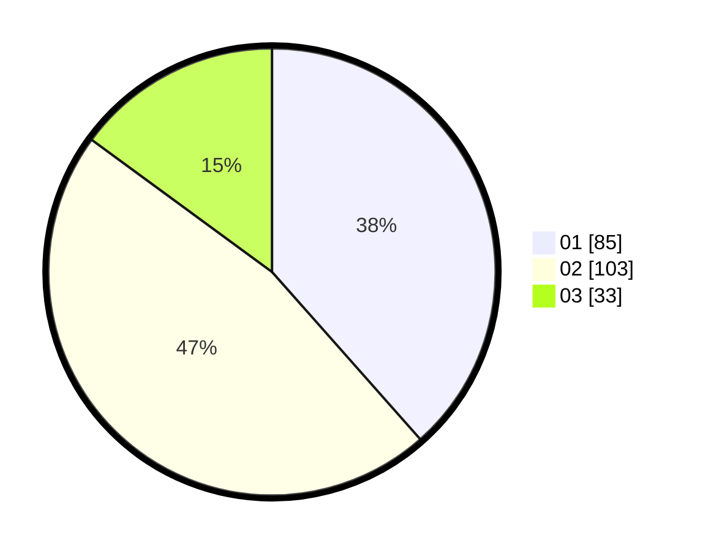

# Hasil

Hasil perolehan suara paslon dapat dilihat pada file paslon-01.txt, paslon-02.txt, dan paslon-03.txt.

Jika tidak ada, artinya data tersebut belum ada pada SIREKAP.

## Perolehan Suara

 * Paslon 01: **85**.
 * Paslon 02: **103**.
 * Paslon 03: **33**.

## Foto C Plano

https://sirekap-obj-formc.kpu.go.id/8bb7/pemilu/ppwp/31/73/06/10/03/3173061003267-20240215-011057--7c3726d0-87c3-4853-99bf-00f4d27c1905.jpg

https://sirekap-obj-formc.kpu.go.id/8bb7/pemilu/ppwp/31/73/06/10/03/3173061003267-20240214-155715--17b0dfcb-30b2-4f59-a2ac-5fdd67fd485f.jpg

https://sirekap-obj-formc.kpu.go.id/8bb7/pemilu/ppwp/31/73/06/10/03/3173061003267-20240215-011107--eb27ed14-b741-42e7-af1b-cc7eb65ec9b1.jpg

## DATA PEMILIH TETAP

Jumlah pemilih dalam DPT: **295**.
 * L: **147**.
 * P: **148**.

## DATA PENGGUNA HAK PILIH

Jumlah pengguna hak pilih dalam DPT: **225**.
 * L: **105**.
 * P: **120**.

Jumlah pengguna hak pilih dalam DPTb: **3**.
 * L: **2**.
 * P: **1**.

Jumlah pengguna hak pilih dalam DPK: **0**.
 * L: **0**.
 * P: **0**.

Jumlah pengguna hak pilih: **228**.
 * L: **107**.
 * P: **121**.

## JUMLAH SUARA SAH DAN TIDAK SAH

JUMLAH SELURUH SUARA SAH: **221**.

JUMLAH SUARA TIDAK SAH: **7**.

JUMLAH SELURUH SUARA SAH DAN SUARA TIDAK SAH: **228**.
