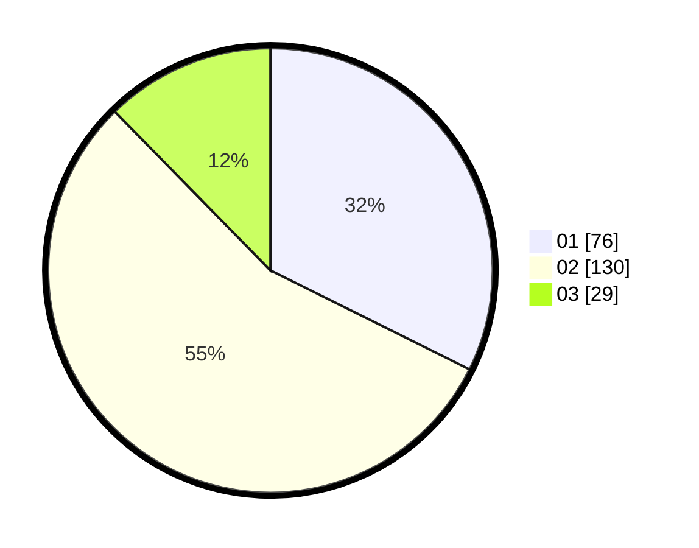

# Hasil

Hasil perolehan suara paslon dapat dilihat pada file paslon-01.txt, paslon-02.txt, dan paslon-03.txt.

Jika tidak ada, artinya data tersebut belum ada pada SIREKAP.

## Perolehan Suara

 * Paslon 01: **76**.
 * Paslon 02: **130**.
 * Paslon 03: **29**.

## Foto C Plano

https://sirekap-obj-formc.kpu.go.id/2c39/pemilu/ppwp/31/73/06/10/03/3173061003268-20240214-221700--e167d263-84a4-4643-b2c0-2d577e9dc5e2.jpg

https://sirekap-obj-formc.kpu.go.id/2c39/pemilu/ppwp/31/73/06/10/03/3173061003268-20240214-225305--5f8ef543-3b81-49f3-8c69-45fbf5f7fcd6.jpg
