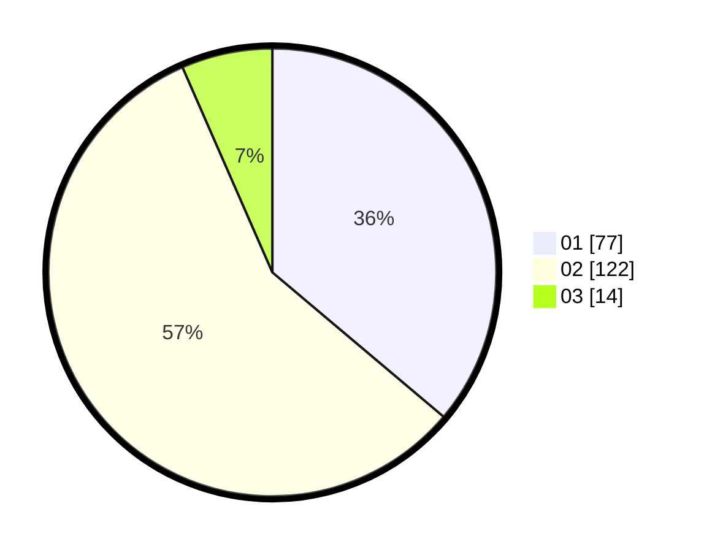

# Hasil

Hasil perolehan suara paslon dapat dilihat pada file paslon-01.txt, paslon-02.txt, dan paslon-03.txt.

Jika tidak ada, artinya data tersebut belum ada pada SIREKAP.

## Perolehan Suara

 * Paslon 01: **77**.
 * Paslon 02: **122**.
 * Paslon 03: **14**.

## Foto C Plano

https://sirekap-obj-formc.kpu.go.id/87d5/pemilu/ppwp/31/73/06/10/03/3173061003269-20240215-044114--47f3e865-0335-44f6-9445-34e3f224a4fa.jpg

https://sirekap-obj-formc.kpu.go.id/87d5/pemilu/ppwp/31/73/06/10/03/3173061003269-20240215-044248--925c2d02-de54-4746-a7dd-6f71594d5e9e.jpg

https://sirekap-obj-formc.kpu.go.id/87d5/pemilu/ppwp/31/73/06/10/03/3173061003269-20240215-044339--c97dd9e9-cfd7-46d7-ab08-c156e627e807.jpg
