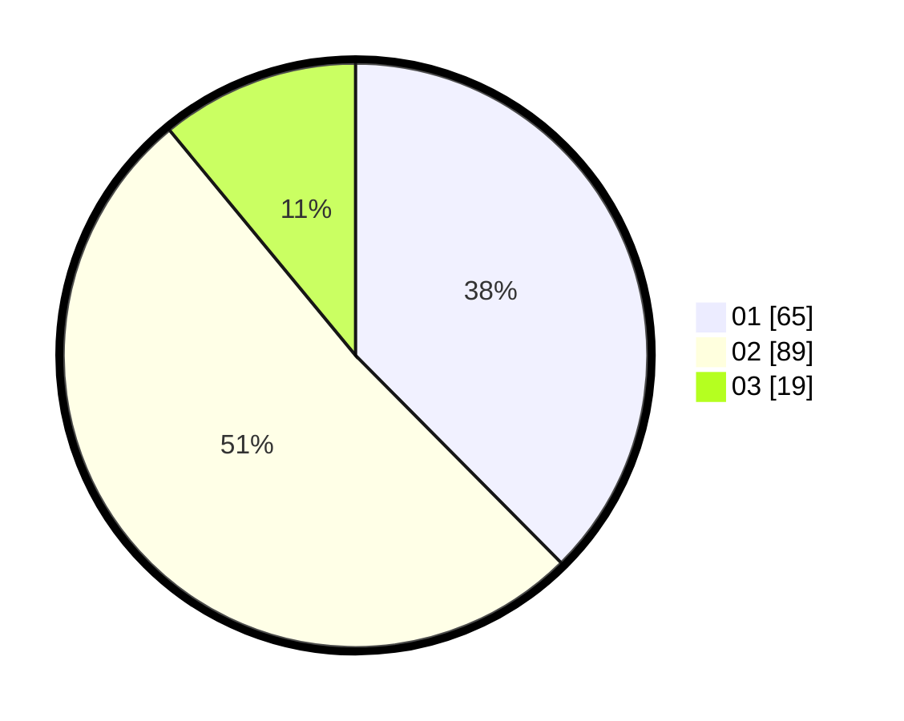

# Hasil

Hasil perolehan suara paslon dapat dilihat pada file paslon-01.txt, paslon-02.txt, dan paslon-03.txt.

Jika tidak ada, artinya data tersebut belum ada pada SIREKAP.

## Perolehan Suara

 * Paslon 01: **65**.
 * Paslon 02: **89**.
 * Paslon 03: **19**.

## Foto C Plano

https://sirekap-obj-formc.kpu.go.id/114e/pemilu/ppwp/31/73/06/10/03/3173061003271-20240214-192927--d36e1b04-08f1-4f6e-b76d-b22398298b40.jpg

https://sirekap-obj-formc.kpu.go.id/114e/pemilu/ppwp/31/73/06/10/03/3173061003271-20240214-193001--f9720157-e612-43cf-b366-cada6b8c81f9.jpg

https://sirekap-obj-formc.kpu.go.id/114e/pemilu/ppwp/31/73/06/10/03/3173061003271-20240214-193034--8ad1242e-c288-48f1-a733-cc23c02e18fd.jpg

## DATA PEMILIH TETAP

Jumlah pemilih dalam DPT: **227**.
 * L: **109**.
 * P: **118**.

## DATA PENGGUNA HAK PILIH

Jumlah pengguna hak pilih dalam DPT: **172**.
 * L: **77**.
 * P: **95**.

Jumlah pengguna hak pilih dalam DPTb: **0**.
 * L: **0**.
 * P: **0**.

Jumlah pengguna hak pilih dalam DPK: **1**.
 * L: **0**.
 * P: **1**.

Jumlah pengguna hak pilih: **173**.
 * L: **77**.
 * P: **96**.

## JUMLAH SUARA SAH DAN TIDAK SAH

JUMLAH SELURUH SUARA SAH: **173**.

JUMLAH SUARA TIDAK SAH: **0**.

JUMLAH SELURUH SUARA SAH DAN SUARA TIDAK SAH: **173**.
