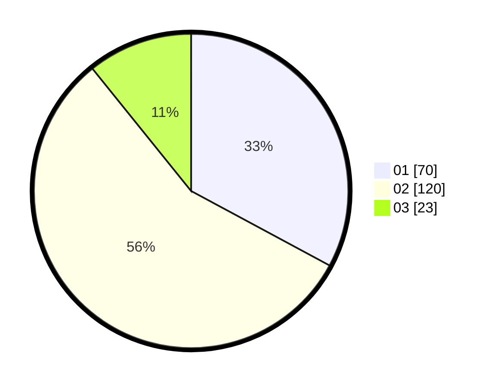

# Hasil

Hasil perolehan suara paslon dapat dilihat pada file paslon-01.txt, paslon-02.txt, dan paslon-03.txt.

Jika tidak ada, artinya data tersebut belum ada pada SIREKAP.

## Perolehan Suara

 * Paslon 01: **70**.
 * Paslon 02: **120**.
 * Paslon 03: **23**.

## Foto C Plano

https://sirekap-obj-formc.kpu.go.id/7661/pemilu/ppwp/31/73/06/10/03/3173061003273-20240215-021538--e28b5e54-d3f6-4eeb-9d20-8a37cd7d6133.jpg

https://sirekap-obj-formc.kpu.go.id/7661/pemilu/ppwp/31/73/06/10/03/3173061003273-20240215-021541--c5ff221f-d66c-4c13-a8c3-cc0b89eeb780.jpg

https://sirekap-obj-formc.kpu.go.id/7661/pemilu/ppwp/31/73/06/10/03/3173061003273-20240215-021545--dcfe3f43-6c27-4449-b0be-ddcc3b3c77db.jpg

## DATA PEMILIH TETAP

Jumlah pemilih dalam DPT: **269**.
 * L: **134**.
 * P: **135**.

## DATA PENGGUNA HAK PILIH

Jumlah pengguna hak pilih dalam DPT: **216**.
 * L: **106**.
 * P: **110**.

Jumlah pengguna hak pilih dalam DPTb: **0**.
 * L: **0**.
 * P: **0**.

Jumlah pengguna hak pilih dalam DPK: **1**.
 * L: **1**.
 * P: **0**.

Jumlah pengguna hak pilih: **217**.
 * L: **107**.
 * P: **110**.

## JUMLAH SUARA SAH DAN TIDAK SAH

JUMLAH SELURUH SUARA SAH: **213**.

JUMLAH SUARA TIDAK SAH: **4**.

JUMLAH SELURUH SUARA SAH DAN SUARA TIDAK SAH: **217**.
