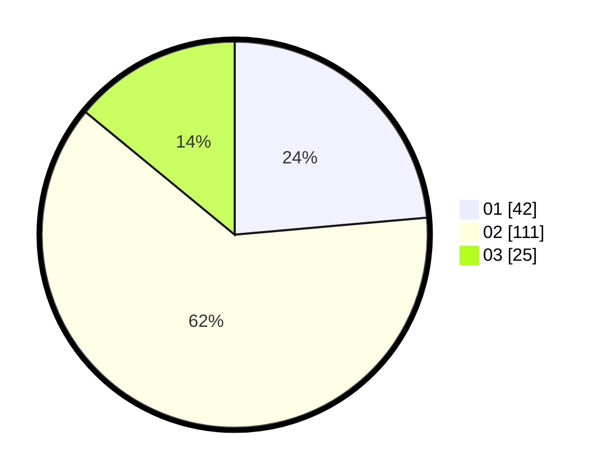

# Hasil

Hasil perolehan suara paslon dapat dilihat pada file paslon-01.txt, paslon-02.txt, dan paslon-03.txt.

Jika tidak ada, artinya data tersebut belum ada pada SIREKAP.

## Perolehan Suara

 * Paslon 01: **42**.
 * Paslon 02: **111**.
 * Paslon 03: **25**.

## Foto C Plano

https://sirekap-obj-formc.kpu.go.id/b83b/pemilu/ppwp/31/73/06/10/03/3173061003274-20240215-205412--839cf0d4-96ff-412b-b87f-40fc6f059d71.jpg

https://sirekap-obj-formc.kpu.go.id/b83b/pemilu/ppwp/31/73/06/10/03/3173061003274-20240215-205415--9111d774-36e6-4155-ab58-0361011b8b73.jpg

https://sirekap-obj-formc.kpu.go.id/b83b/pemilu/ppwp/31/73/06/10/03/3173061003274-20240215-205413--4d7da72e-9c38-4c41-8ab1-86b2cb82cf28.jpg

## DATA PEMILIH TETAP

Jumlah pemilih dalam DPT: **273**.
 * L: **129**.
 * P: **144**.

## DATA PENGGUNA HAK PILIH

Jumlah pengguna hak pilih dalam DPT: **177**.
 * L: **84**.
 * P: **93**.

Jumlah pengguna hak pilih dalam DPTb: **2**.
 * L: **2**.
 * P: **0**.

Jumlah pengguna hak pilih dalam DPK: **2**.
 * L: **1**.
 * P: **1**.

Jumlah pengguna hak pilih: **181**.
 * L: **87**.
 * P: **94**.

## JUMLAH SUARA SAH DAN TIDAK SAH

JUMLAH SELURUH SUARA SAH: **178**.

JUMLAH SUARA TIDAK SAH: **3**.

JUMLAH SELURUH SUARA SAH DAN SUARA TIDAK SAH: **181**.
