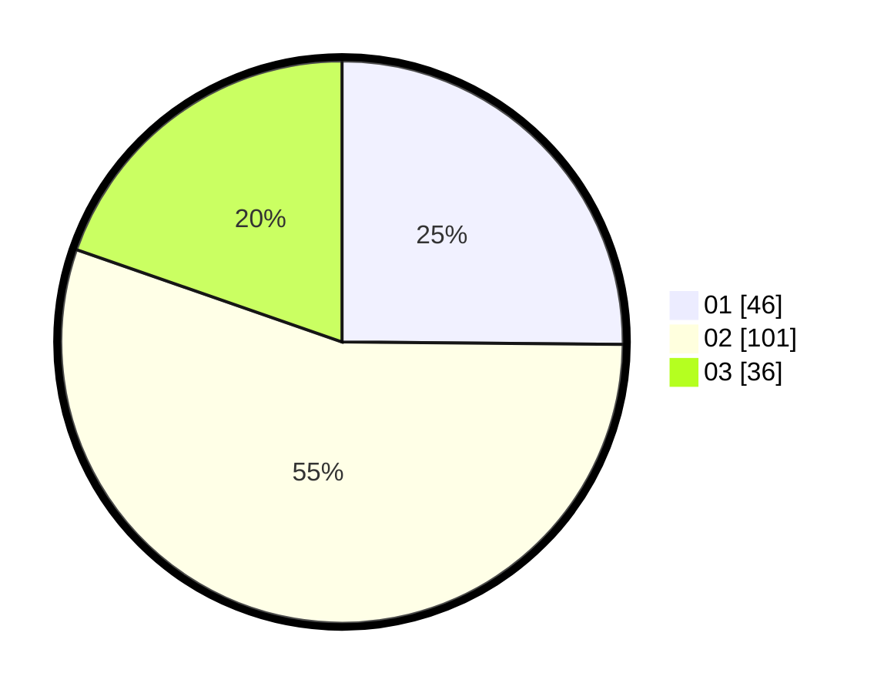

# Hasil

Hasil perolehan suara paslon dapat dilihat pada file paslon-01.txt, paslon-02.txt, dan paslon-03.txt.

Jika tidak ada, artinya data tersebut belum ada pada SIREKAP.

## Perolehan Suara

 * Paslon 01: **46**.
 * Paslon 02: **101**.
 * Paslon 03: **36**.

## Foto C Plano

https://sirekap-obj-formc.kpu.go.id/8f0c/pemilu/ppwp/31/73/06/10/03/3173061003276-20240214-224742--2fff7e55-04f1-4540-be4a-f32677ebfce9.jpg

https://sirekap-obj-formc.kpu.go.id/8f0c/pemilu/ppwp/31/73/06/10/03/3173061003276-20240214-225732--515b02ac-1333-46f1-b419-fd589ed52bfa.jpg

https://sirekap-obj-formc.kpu.go.id/8f0c/pemilu/ppwp/31/73/06/10/03/3173061003276-20240214-225115--e7ce0eba-bb34-4eeb-9a64-af100b893b2f.jpg
