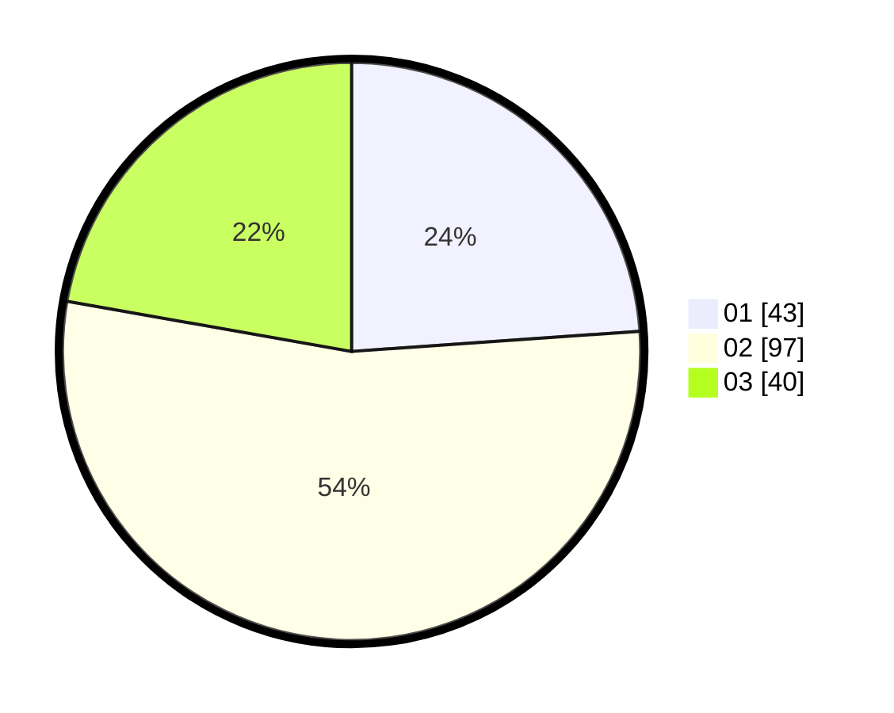

# Hasil

Hasil perolehan suara paslon dapat dilihat pada file paslon-01.txt, paslon-02.txt, dan paslon-03.txt.

Jika tidak ada, artinya data tersebut belum ada pada SIREKAP.

## Perolehan Suara

 * Paslon 01: **43**.
 * Paslon 02: **97**.
 * Paslon 03: **40**.

## Foto C Plano

https://sirekap-obj-formc.kpu.go.id/9abe/pemilu/ppwp/31/73/06/10/03/3173061003278-20240214-155625--03afb14b-2a6d-4fbb-b9cb-93aaf0dc88d3.jpg

https://sirekap-obj-formc.kpu.go.id/9abe/pemilu/ppwp/31/73/06/10/03/3173061003278-20240214-155335--c33a2a05-0648-4068-ac85-44c0f5e4cc7e.jpg

https://sirekap-obj-formc.kpu.go.id/9abe/pemilu/ppwp/31/73/06/10/03/3173061003278-20240214-155608--194f3411-bf63-4571-bb06-5ca963f3c348.jpg
