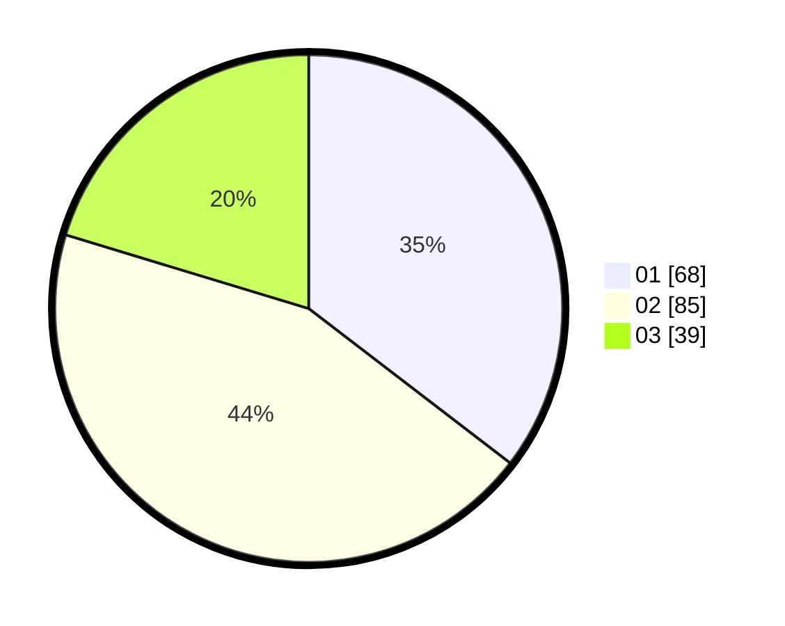

# Hasil

Hasil perolehan suara paslon dapat dilihat pada file paslon-01.txt, paslon-02.txt, dan paslon-03.txt.

Jika tidak ada, artinya data tersebut belum ada pada SIREKAP.

## Perolehan Suara

 * Paslon 01: **68**.
 * Paslon 02: **85**.
 * Paslon 03: **39**.

## Foto C Plano

https://sirekap-obj-formc.kpu.go.id/48e7/pemilu/ppwp/31/73/06/10/03/3173061003282-20240216-042940--3b5386a6-f3a8-4260-8560-68b07d321598.jpg

https://sirekap-obj-formc.kpu.go.id/48e7/pemilu/ppwp/31/73/06/10/03/3173061003282-20240216-042755--fbbb3e2c-9bf4-4561-9767-6bc32499cf25.jpg

https://sirekap-obj-formc.kpu.go.id/48e7/pemilu/ppwp/31/73/06/10/03/3173061003282-20240216-042753--2c72e048-a39b-405c-88f2-9b6c3d689402.jpg

## DATA PEMILIH TETAP

Jumlah pemilih dalam DPT: **195**.
 * L: **99**.
 * P: **96**.

## DATA PENGGUNA HAK PILIH

Jumlah pengguna hak pilih dalam DPT: **195**.
 * L: **99**.
 * P: **96**.

Jumlah pengguna hak pilih dalam DPTb: **0**.
 * L: **0**.
 * P: **0**.

Jumlah pengguna hak pilih dalam DPK: **0**.
 * L: **0**.
 * P: **0**.

Jumlah pengguna hak pilih: **195**.
 * L: **99**.
 * P: **96**.

## JUMLAH SUARA SAH DAN TIDAK SAH

JUMLAH SELURUH SUARA SAH: **192**.

JUMLAH SUARA TIDAK SAH: **3**.

JUMLAH SELURUH SUARA SAH DAN SUARA TIDAK SAH: **195**.
