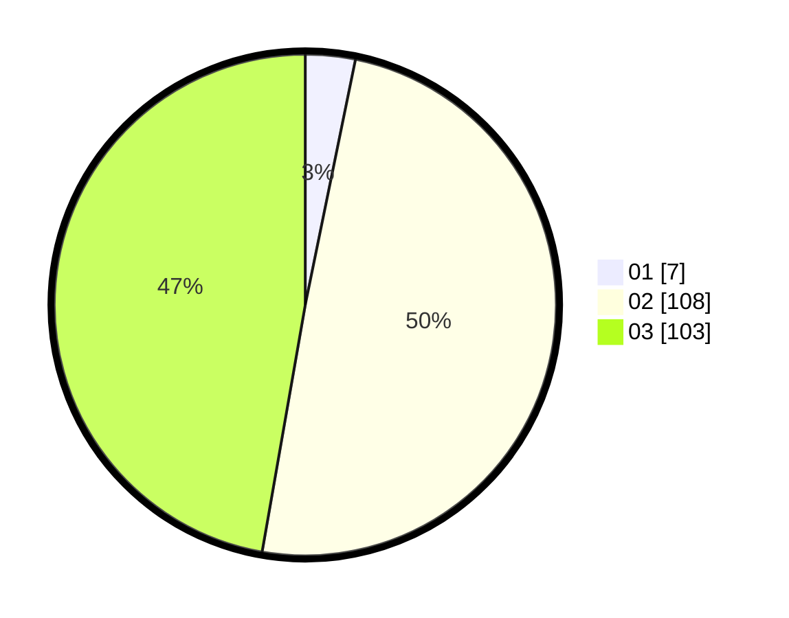

# Hasil

Hasil perolehan suara paslon dapat dilihat pada file paslon-01.txt, paslon-02.txt, dan paslon-03.txt.

Jika tidak ada, artinya data tersebut belum ada pada SIREKAP.

## Perolehan Suara

 * Paslon 01: **7**.
 * Paslon 02: **108**.
 * Paslon 03: **103**.

## Foto C Plano

https://sirekap-obj-formc.kpu.go.id/899e/pemilu/ppwp/31/73/06/10/03/3173061003287-20240214-184959--da4069f6-0b1c-4999-924b-73e6658e5ded.jpg

https://sirekap-obj-formc.kpu.go.id/899e/pemilu/ppwp/31/73/06/10/03/3173061003287-20240214-190601--6e2d516c-9d21-4c46-9ffc-4da877b7b7ad.jpg

https://sirekap-obj-formc.kpu.go.id/899e/pemilu/ppwp/31/73/06/10/03/3173061003287-20240214-185027--0030adc2-42e2-4670-8c48-74426a32938c.jpg

## DATA PEMILIH TETAP

Jumlah pemilih dalam DPT: **297**.
 * L: **155**.
 * P: **142**.

## DATA PENGGUNA HAK PILIH

Jumlah pengguna hak pilih dalam DPT: **202**.
 * L: **102**.
 * P: **100**.

Jumlah pengguna hak pilih dalam DPTb: **0**.
 * L: **0**.
 * P: **0**.

Jumlah pengguna hak pilih dalam DPK: **13**.
 * L: **6**.
 * P: **7**.

Jumlah pengguna hak pilih: **215**.
 * L: **108**.
 * P: **107**.

## JUMLAH SUARA SAH DAN TIDAK SAH

JUMLAH SELURUH SUARA SAH: **214**.

JUMLAH SUARA TIDAK SAH: **1**.

JUMLAH SELURUH SUARA SAH DAN SUARA TIDAK SAH: **215**.
