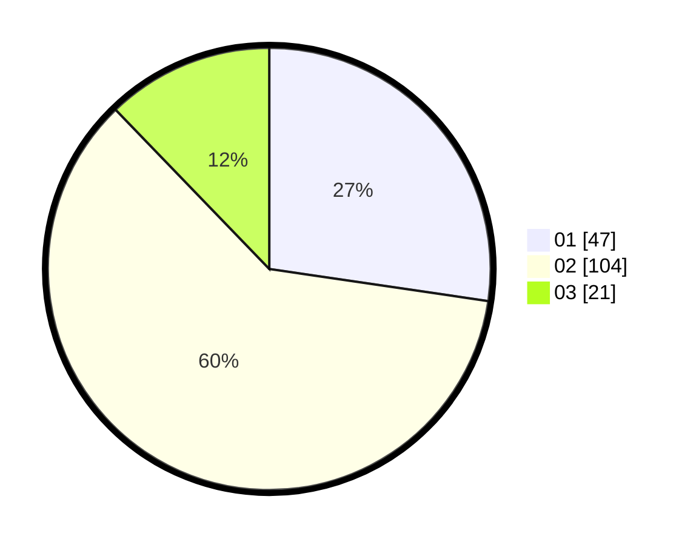

# Hasil

Hasil perolehan suara paslon dapat dilihat pada file paslon-01.txt, paslon-02.txt, dan paslon-03.txt.

Jika tidak ada, artinya data tersebut belum ada pada SIREKAP.

## Perolehan Suara

 * Paslon 01: **47**.
 * Paslon 02: **104**.
 * Paslon 03: **21**.

## Foto C Plano

https://sirekap-obj-formc.kpu.go.id/63b1/pemilu/ppwp/31/73/06/10/04/3173061004001-20240215-214556--32271f1e-6348-47d9-a9f9-9ef128851f2d.jpg

https://sirekap-obj-formc.kpu.go.id/63b1/pemilu/ppwp/31/73/06/10/04/3173061004001-20240214-191209--7cecbdb3-94b0-428d-9766-c2da77db3e03.jpg

https://sirekap-obj-formc.kpu.go.id/63b1/pemilu/ppwp/31/73/06/10/04/3173061004001-20240214-191243--05e081b3-50e3-4958-a4e4-d3636d430cfa.jpg

## DATA PEMILIH TETAP

Jumlah pemilih dalam DPT: **225**.
 * L: **113**.
 * P: **112**.

## DATA PENGGUNA HAK PILIH

Jumlah pengguna hak pilih dalam DPT: **174**.
 * L: **84**.
 * P: **90**.

Jumlah pengguna hak pilih dalam DPTb: **0**.
 * L: **0**.
 * P: **0**.

Jumlah pengguna hak pilih dalam DPK: **0**.
 * L: **0**.
 * P: **0**.

Jumlah pengguna hak pilih: **174**.
 * L: **84**.
 * P: **90**.

## JUMLAH SUARA SAH DAN TIDAK SAH

JUMLAH SELURUH SUARA SAH: **172**.

JUMLAH SUARA TIDAK SAH: **2**.

JUMLAH SELURUH SUARA SAH DAN SUARA TIDAK SAH: **174**.
