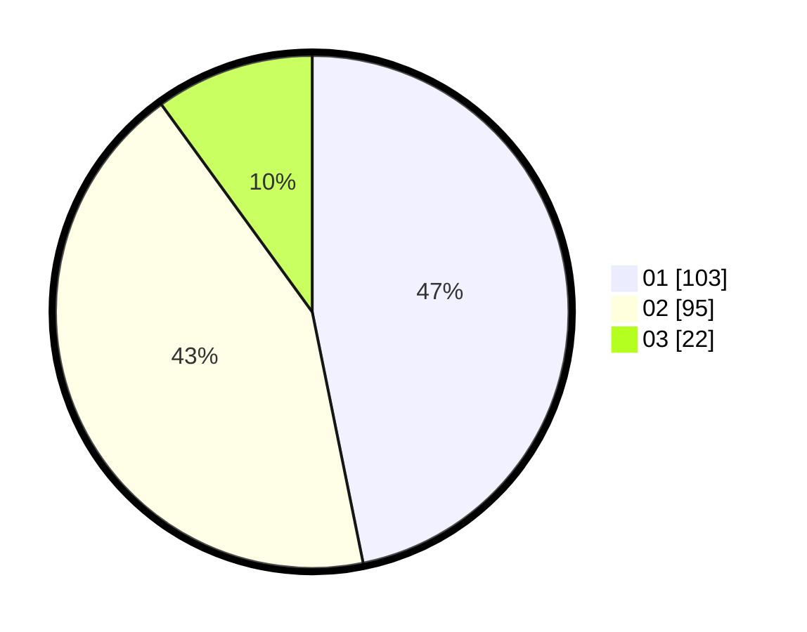

# Hasil

Hasil perolehan suara paslon dapat dilihat pada file paslon-01.txt, paslon-02.txt, dan paslon-03.txt.

Jika tidak ada, artinya data tersebut belum ada pada SIREKAP.

## Perolehan Suara

 * Paslon 01: **103**.
 * Paslon 02: **95**.
 * Paslon 03: **22**.

## Foto C Plano

https://sirekap-obj-formc.kpu.go.id/7bf3/pemilu/ppwp/31/73/06/10/04/3173061004004-20240215-191330--52527079-9590-4afb-b89e-956b783215a4.jpg

https://sirekap-obj-formc.kpu.go.id/7bf3/pemilu/ppwp/31/73/06/10/04/3173061004004-20240215-191331--cb902706-fd7b-4d86-808d-c3ef00d1ae77.jpg

https://sirekap-obj-formc.kpu.go.id/7bf3/pemilu/ppwp/31/73/06/10/04/3173061004004-20240215-191330--74a059b5-12f4-4718-b339-e439f53df567.jpg

## DATA PEMILIH TETAP

Jumlah pemilih dalam DPT: **293**.
 * L: **145**.
 * P: **148**.

## DATA PENGGUNA HAK PILIH

Jumlah pengguna hak pilih dalam DPT: **221**.
 * L: **112**.
 * P: **109**.

Jumlah pengguna hak pilih dalam DPTb: **0**.
 * L: **0**.
 * P: **0**.

Jumlah pengguna hak pilih dalam DPK: **2**.
 * L: **1**.
 * P: **1**.

Jumlah pengguna hak pilih: **223**.
 * L: **113**.
 * P: **110**.

## JUMLAH SUARA SAH DAN TIDAK SAH

JUMLAH SELURUH SUARA SAH: **220**.

JUMLAH SUARA TIDAK SAH: **3**.

JUMLAH SELURUH SUARA SAH DAN SUARA TIDAK SAH: **223**.
