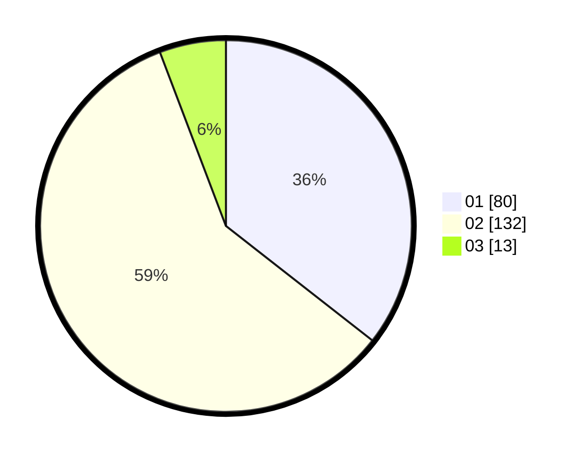

# Hasil

Hasil perolehan suara paslon dapat dilihat pada file paslon-01.txt, paslon-02.txt, dan paslon-03.txt.

Jika tidak ada, artinya data tersebut belum ada pada SIREKAP.

## Perolehan Suara

 * Paslon 01: **80**.
 * Paslon 02: **132**.
 * Paslon 03: **13**.

## Foto C Plano

https://sirekap-obj-formc.kpu.go.id/981b/pemilu/ppwp/31/73/06/10/04/3173061004008-20240214-205229--c9105f83-a1cd-4fac-914f-c258aafbf89f.jpg

https://sirekap-obj-formc.kpu.go.id/981b/pemilu/ppwp/31/73/06/10/04/3173061004008-20240214-205338--f5880a43-7f4b-473f-baf7-6e58bbea29e2.jpg

https://sirekap-obj-formc.kpu.go.id/981b/pemilu/ppwp/31/73/06/10/04/3173061004008-20240214-205532--e1b92aa4-de71-468b-943c-1a7d791208fd.jpg

## DATA PEMILIH TETAP

Jumlah pemilih dalam DPT: **287**.
 * L: **146**.
 * P: **141**.

## DATA PENGGUNA HAK PILIH

Jumlah pengguna hak pilih dalam DPT: **226**.
 * L: **113**.
 * P: **113**.

Jumlah pengguna hak pilih dalam DPTb: **2**.
 * L: **1**.
 * P: **1**.

Jumlah pengguna hak pilih dalam DPK: **0**.
 * L: **0**.
 * P: **0**.

Jumlah pengguna hak pilih: **228**.
 * L: **114**.
 * P: **114**.

## JUMLAH SUARA SAH DAN TIDAK SAH

JUMLAH SELURUH SUARA SAH: **225**.

JUMLAH SUARA TIDAK SAH: **3**.

JUMLAH SELURUH SUARA SAH DAN SUARA TIDAK SAH: **228**.
