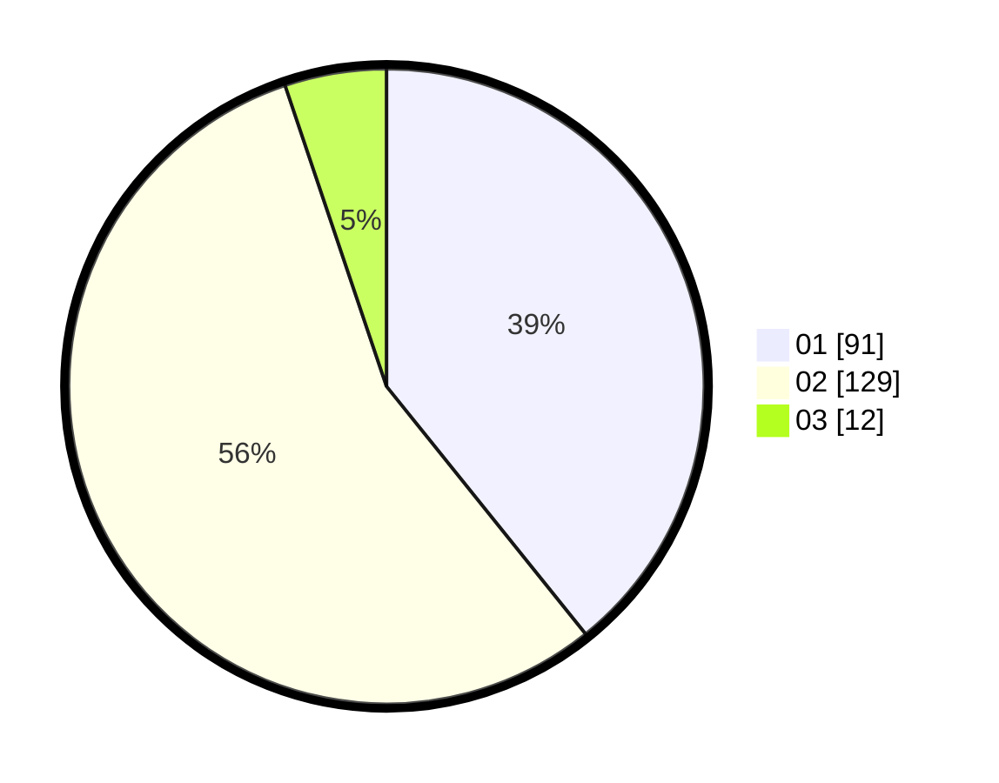

# Hasil

Hasil perolehan suara paslon dapat dilihat pada file paslon-01.txt, paslon-02.txt, dan paslon-03.txt.

Jika tidak ada, artinya data tersebut belum ada pada SIREKAP.

## Perolehan Suara

 * Paslon 01: **91**.
 * Paslon 02: **129**.
 * Paslon 03: **12**.

## Foto C Plano

https://sirekap-obj-formc.kpu.go.id/7be0/pemilu/ppwp/31/73/06/10/04/3173061004009-20240214-230124--7a21087a-2b0c-4356-b720-eeba9d79ca19.jpg

https://sirekap-obj-formc.kpu.go.id/7be0/pemilu/ppwp/31/73/06/10/04/3173061004009-20240214-230209--b4f7827d-6715-4bdd-beb5-c7cb2964afc1.jpg

https://sirekap-obj-formc.kpu.go.id/7be0/pemilu/ppwp/31/73/06/10/04/3173061004009-20240214-230247--25e07d45-2d15-46f8-a88c-f807cfa9f451.jpg
