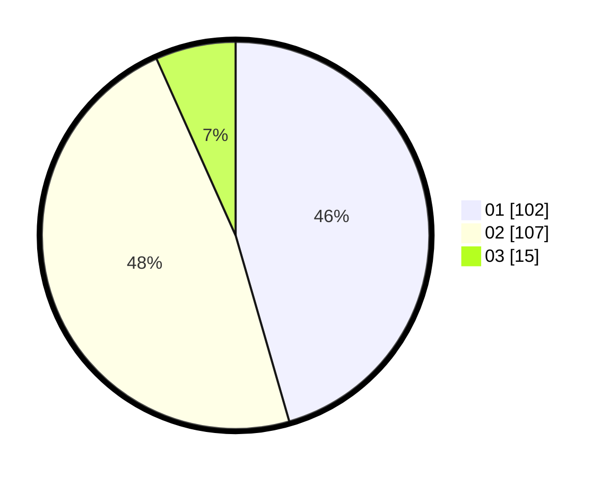

# Hasil

Hasil perolehan suara paslon dapat dilihat pada file paslon-01.txt, paslon-02.txt, dan paslon-03.txt.

Jika tidak ada, artinya data tersebut belum ada pada SIREKAP.

## Perolehan Suara

 * Paslon 01: **102**.
 * Paslon 02: **107**.
 * Paslon 03: **15**.

## Foto C Plano

https://sirekap-obj-formc.kpu.go.id/61a1/pemilu/ppwp/31/73/06/10/04/3173061004010-20240216-003357--9eb12d12-23ed-4dc6-ad72-bf8ad199f21a.jpg

https://sirekap-obj-formc.kpu.go.id/61a1/pemilu/ppwp/31/73/06/10/04/3173061004010-20240216-003358--8b0921c4-4497-4ea9-bf06-9bd4087dcd04.jpg

https://sirekap-obj-formc.kpu.go.id/61a1/pemilu/ppwp/31/73/06/10/04/3173061004010-20240216-003357--4e9f671a-4d3a-4894-a653-dc42d87a6dab.jpg

## DATA PEMILIH TETAP

Jumlah pemilih dalam DPT: **286**.
 * L: **151**.
 * P: **135**.

## DATA PENGGUNA HAK PILIH

Jumlah pengguna hak pilih dalam DPT: **217**.
 * L: **111**.
 * P: **106**.

Jumlah pengguna hak pilih dalam DPTb: **5**.
 * L: **2**.
 * P: **3**.

Jumlah pengguna hak pilih dalam DPK: **5**.
 * L: **3**.
 * P: **2**.

Jumlah pengguna hak pilih: **227**.
 * L: **116**.
 * P: **111**.

## JUMLAH SUARA SAH DAN TIDAK SAH

JUMLAH SELURUH SUARA SAH: **224**.

JUMLAH SUARA TIDAK SAH: **3**.

JUMLAH SELURUH SUARA SAH DAN SUARA TIDAK SAH: **227**.
