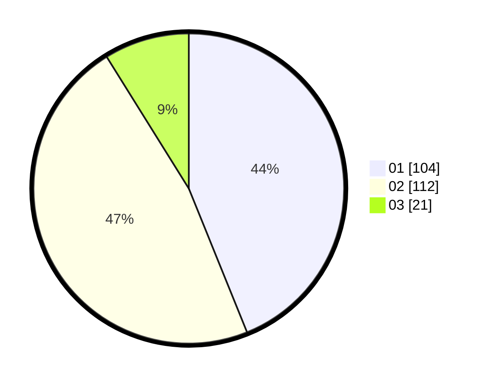

# Hasil

Hasil perolehan suara paslon dapat dilihat pada file paslon-01.txt, paslon-02.txt, dan paslon-03.txt.

Jika tidak ada, artinya data tersebut belum ada pada SIREKAP.

## Perolehan Suara

 * Paslon 01: **104**.
 * Paslon 02: **112**.
 * Paslon 03: **21**.

## Foto C Plano

https://sirekap-obj-formc.kpu.go.id/1000/pemilu/ppwp/31/73/06/10/04/3173061004014-20240215-000939--6a53faeb-65d2-4d70-816a-1371298933aa.jpg

https://sirekap-obj-formc.kpu.go.id/1000/pemilu/ppwp/31/73/06/10/04/3173061004014-20240214-201744--c75b6c23-a5da-496a-9dfe-bcbe37471cea.jpg

https://sirekap-obj-formc.kpu.go.id/1000/pemilu/ppwp/31/73/06/10/04/3173061004014-20240214-201821--4f018cef-fdd5-4508-822d-9d81feb61058.jpg
