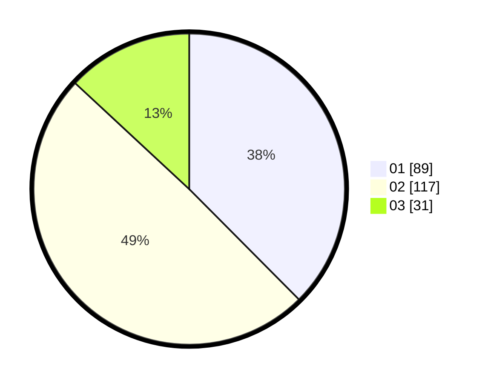

# Hasil

Hasil perolehan suara paslon dapat dilihat pada file paslon-01.txt, paslon-02.txt, dan paslon-03.txt.

Jika tidak ada, artinya data tersebut belum ada pada SIREKAP.

## Perolehan Suara

 * Paslon 01: **89**.
 * Paslon 02: **117**.
 * Paslon 03: **31**.

## Foto C Plano

https://sirekap-obj-formc.kpu.go.id/0dce/pemilu/ppwp/31/73/06/10/04/3173061004017-20240216-002156--f7bb8f94-c654-4ed1-8707-f1982aa95b1e.jpg

https://sirekap-obj-formc.kpu.go.id/0dce/pemilu/ppwp/31/73/06/10/04/3173061004017-20240216-002158--0bac25ab-521c-4791-bd32-531684f2e224.jpg

https://sirekap-obj-formc.kpu.go.id/0dce/pemilu/ppwp/31/73/06/10/04/3173061004017-20240216-002157--692a7b11-5134-41d6-9554-3266e13162b8.jpg

## DATA PEMILIH TETAP

Jumlah pemilih dalam DPT: **285**.
 * L: **143**.
 * P: **142**.

## DATA PENGGUNA HAK PILIH

Jumlah pengguna hak pilih dalam DPT: **236**.
 * L: **116**.
 * P: **120**.

Jumlah pengguna hak pilih dalam DPTb: **0**.
 * L: **0**.
 * P: **0**.

Jumlah pengguna hak pilih dalam DPK: **3**.
 * L: **1**.
 * P: **2**.

Jumlah pengguna hak pilih: **239**.
 * L: **117**.
 * P: **122**.

## JUMLAH SUARA SAH DAN TIDAK SAH

JUMLAH SELURUH SUARA SAH: **237**.

JUMLAH SUARA TIDAK SAH: **2**.

JUMLAH SELURUH SUARA SAH DAN SUARA TIDAK SAH: **239**.
