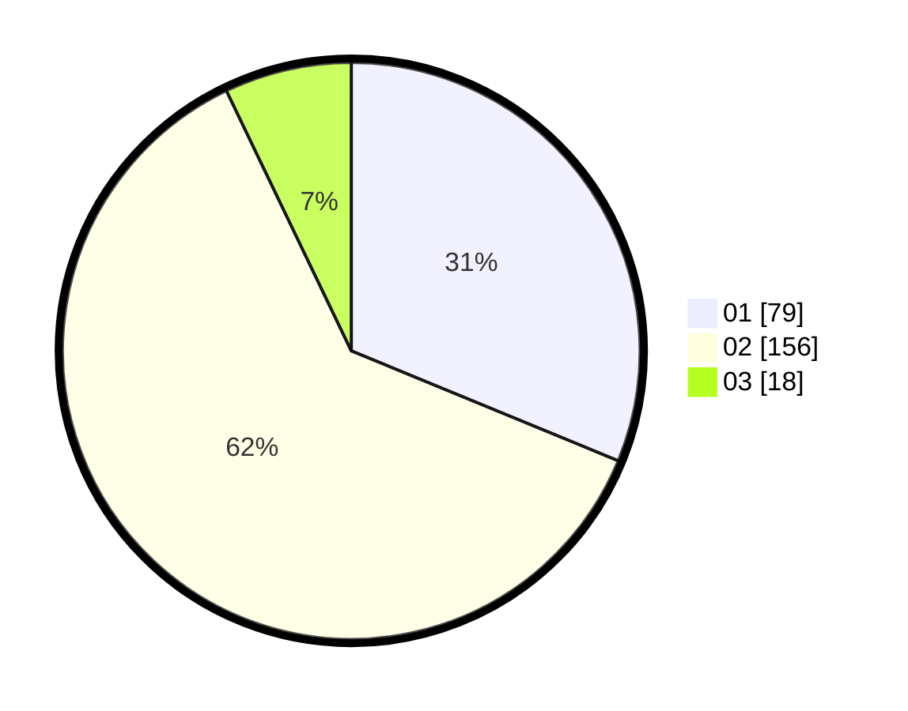

# Hasil

Hasil perolehan suara paslon dapat dilihat pada file paslon-01.txt, paslon-02.txt, dan paslon-03.txt.

Jika tidak ada, artinya data tersebut belum ada pada SIREKAP.

## Perolehan Suara

 * Paslon 01: **79**.
 * Paslon 02: **156**.
 * Paslon 03: **18**.

## Foto C Plano

https://sirekap-obj-formc.kpu.go.id/b859/pemilu/ppwp/31/73/06/10/04/3173061004019-20240216-051004--219a5f4e-8108-4cd7-a5b5-24062b831b3e.jpg

https://sirekap-obj-formc.kpu.go.id/b859/pemilu/ppwp/31/73/06/10/04/3173061004019-20240214-155351--7c94633d-8113-466c-8224-3267f4fdd872.jpg

https://sirekap-obj-formc.kpu.go.id/b859/pemilu/ppwp/31/73/06/10/04/3173061004019-20240216-051009--eb532678-5690-4bce-81ff-2060378affe3.jpg

## DATA PEMILIH TETAP

Jumlah pemilih dalam DPT: **295**.
 * L: **144**.
 * P: **151**.

## DATA PENGGUNA HAK PILIH

Jumlah pengguna hak pilih dalam DPT: **250**.
 * L: **124**.
 * P: **126**.

Jumlah pengguna hak pilih dalam DPTb: **0**.
 * L: **0**.
 * P: **0**.

Jumlah pengguna hak pilih dalam DPK: **250**.
 * L: **124**.
 * P: **126**.

Jumlah pengguna hak pilih: **250**.
 * L: **124**.
 * P: **126**.

## JUMLAH SUARA SAH DAN TIDAK SAH

JUMLAH SELURUH SUARA SAH: **253**.

JUMLAH SUARA TIDAK SAH: **2**.

JUMLAH SELURUH SUARA SAH DAN SUARA TIDAK SAH: **255**.
