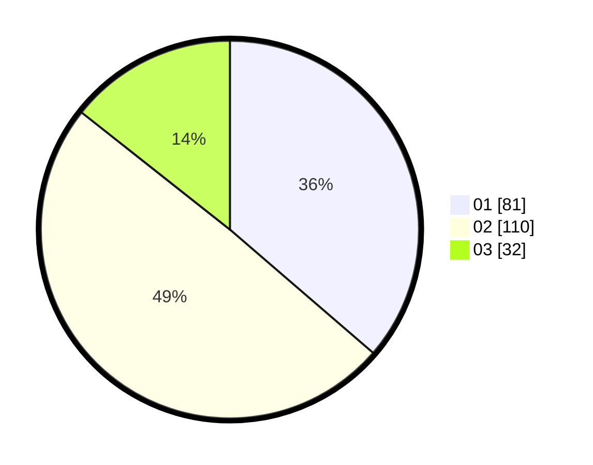

# Hasil

Hasil perolehan suara paslon dapat dilihat pada file paslon-01.txt, paslon-02.txt, dan paslon-03.txt.

Jika tidak ada, artinya data tersebut belum ada pada SIREKAP.

## Perolehan Suara

 * Paslon 01: **81**.
 * Paslon 02: **110**.
 * Paslon 03: **32**.

## Foto C Plano

https://sirekap-obj-formc.kpu.go.id/1378/pemilu/ppwp/31/73/06/10/04/3173061004020-20240214-190208--a01b19e6-babb-4fc6-93fd-a583f69a0c51.jpg

https://sirekap-obj-formc.kpu.go.id/1378/pemilu/ppwp/31/73/06/10/04/3173061004020-20240214-192201--f6d17bb7-82cf-408c-ba5c-53d8638b3d9a.jpg

https://sirekap-obj-formc.kpu.go.id/1378/pemilu/ppwp/31/73/06/10/04/3173061004020-20240214-190215--6756b46a-4a29-47eb-9e2a-2dc4250bb372.jpg

## DATA PEMILIH TETAP

Jumlah pemilih dalam DPT: **288**.
 * L: **139**.
 * P: **149**.

## DATA PENGGUNA HAK PILIH

Jumlah pengguna hak pilih dalam DPT: **227**.
 * L: **102**.
 * P: **125**.

Jumlah pengguna hak pilih dalam DPTb: **0**.
 * L: **0**.
 * P: **0**.

Jumlah pengguna hak pilih dalam DPK: **1**.
 * L: **0**.
 * P: **1**.

Jumlah pengguna hak pilih: **228**.
 * L: **102**.
 * P: **126**.

## JUMLAH SUARA SAH DAN TIDAK SAH

JUMLAH SELURUH SUARA SAH: **223**.

JUMLAH SUARA TIDAK SAH: **5**.

JUMLAH SELURUH SUARA SAH DAN SUARA TIDAK SAH: **228**.
