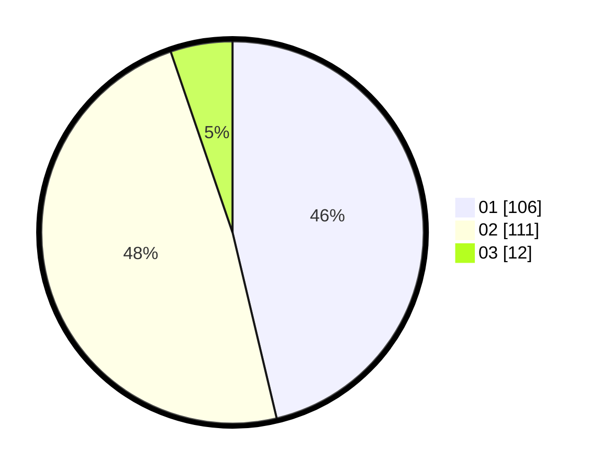

# Hasil

Hasil perolehan suara paslon dapat dilihat pada file paslon-01.txt, paslon-02.txt, dan paslon-03.txt.

Jika tidak ada, artinya data tersebut belum ada pada SIREKAP.

## Perolehan Suara

 * Paslon 01: **106**.
 * Paslon 02: **111**.
 * Paslon 03: **12**.

## Foto C Plano

https://sirekap-obj-formc.kpu.go.id/a5bd/pemilu/ppwp/31/73/06/10/04/3173061004021-20240214-221445--8a8f33e3-543e-4870-a9ab-3ad98e43339f.jpg

https://sirekap-obj-formc.kpu.go.id/a5bd/pemilu/ppwp/31/73/06/10/04/3173061004021-20240214-221659--6edfe936-0ecc-4730-91f0-53f5546e029e.jpg

https://sirekap-obj-formc.kpu.go.id/a5bd/pemilu/ppwp/31/73/06/10/04/3173061004021-20240214-221903--a09fc731-d283-43a8-9e13-4c78c4796c1d.jpg
