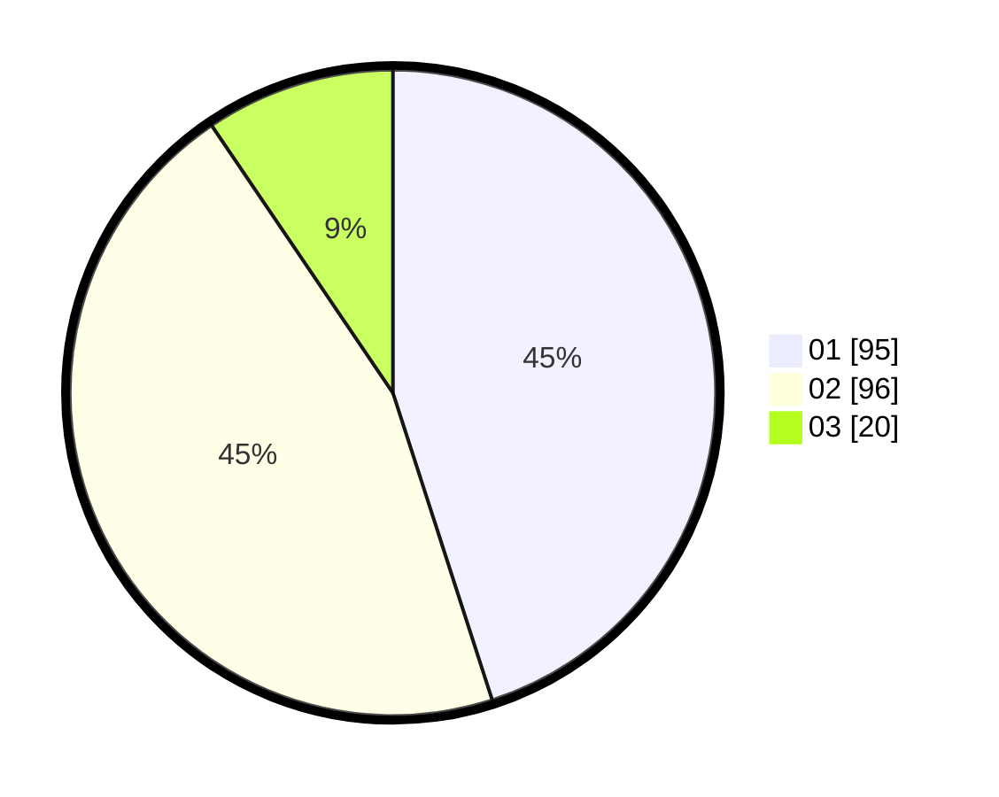

# Hasil

Hasil perolehan suara paslon dapat dilihat pada file paslon-01.txt, paslon-02.txt, dan paslon-03.txt.

Jika tidak ada, artinya data tersebut belum ada pada SIREKAP.

## Perolehan Suara

 * Paslon 01: **95**.
 * Paslon 02: **96**.
 * Paslon 03: **20**.

## Foto C Plano

https://sirekap-obj-formc.kpu.go.id/6a30/pemilu/ppwp/31/73/06/10/04/3173061004025-20240215-013012--66bdaa68-7568-4e7e-992a-dd509351ce7b.jpg

https://sirekap-obj-formc.kpu.go.id/6a30/pemilu/ppwp/31/73/06/10/04/3173061004025-20240215-013125--ac086dd7-e57d-40cb-88c5-c9f202413645.jpg

https://sirekap-obj-formc.kpu.go.id/6a30/pemilu/ppwp/31/73/06/10/04/3173061004025-20240215-013212--febf60f5-5d5e-419c-bede-629e8b3ae733.jpg

## DATA PEMILIH TETAP

Jumlah pemilih dalam DPT: **268**.
 * L: **123**.
 * P: **145**.

## DATA PENGGUNA HAK PILIH

Jumlah pengguna hak pilih dalam DPT: **213**.
 * L: **98**.
 * P: **115**.

Jumlah pengguna hak pilih dalam DPTb: **0**.
 * L: **0**.
 * P: **0**.

Jumlah pengguna hak pilih dalam DPK: **5**.
 * L: **3**.
 * P: **2**.

Jumlah pengguna hak pilih: **218**.
 * L: **101**.
 * P: **117**.

## JUMLAH SUARA SAH DAN TIDAK SAH

JUMLAH SELURUH SUARA SAH: **211**.

JUMLAH SUARA TIDAK SAH: **7**.

JUMLAH SELURUH SUARA SAH DAN SUARA TIDAK SAH: **218**.
