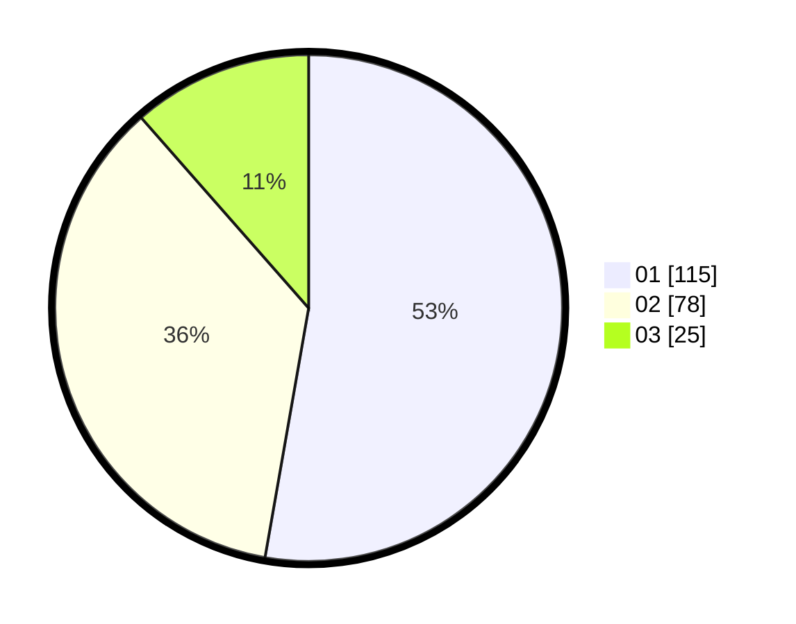

# Hasil

Hasil perolehan suara paslon dapat dilihat pada file paslon-01.txt, paslon-02.txt, dan paslon-03.txt.

Jika tidak ada, artinya data tersebut belum ada pada SIREKAP.

## Perolehan Suara

 * Paslon 01: **115**.
 * Paslon 02: **78**.
 * Paslon 03: **25**.

## Foto C Plano

https://sirekap-obj-formc.kpu.go.id/005b/pemilu/ppwp/31/73/06/10/04/3173061004026-20240215-022023--c57d47cd-5eb1-4990-9325-86d56e6e6cd2.jpg

https://sirekap-obj-formc.kpu.go.id/005b/pemilu/ppwp/31/73/06/10/04/3173061004026-20240214-215659--4f4fd6f4-27f6-44dd-a157-c74fb29a3211.jpg

https://sirekap-obj-formc.kpu.go.id/005b/pemilu/ppwp/31/73/06/10/04/3173061004026-20240215-143954--a2e6f277-74ec-482a-9a03-6e4e59643798.jpg

## DATA PEMILIH TETAP

Jumlah pemilih dalam DPT: **266**.
 * L: **140**.
 * P: **126**.

## DATA PENGGUNA HAK PILIH

Jumlah pengguna hak pilih dalam DPT: **221**.
 * L: **113**.
 * P: **108**.

Jumlah pengguna hak pilih dalam DPTb: **0**.
 * L: **0**.
 * P: **0**.

Jumlah pengguna hak pilih dalam DPK: **2**.
 * L: **0**.
 * P: **2**.

Jumlah pengguna hak pilih: **223**.
 * L: **113**.
 * P: **110**.

## JUMLAH SUARA SAH DAN TIDAK SAH

JUMLAH SELURUH SUARA SAH: **218**.

JUMLAH SUARA TIDAK SAH: **5**.

JUMLAH SELURUH SUARA SAH DAN SUARA TIDAK SAH: **223**.
