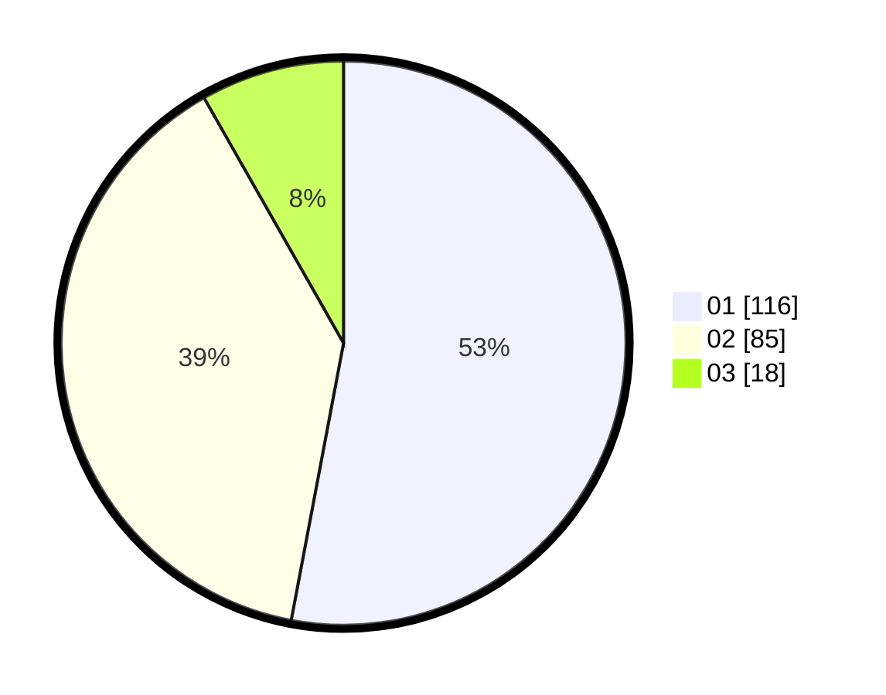

# Hasil

Hasil perolehan suara paslon dapat dilihat pada file paslon-01.txt, paslon-02.txt, dan paslon-03.txt.

Jika tidak ada, artinya data tersebut belum ada pada SIREKAP.

## Perolehan Suara

 * Paslon 01: **116**.
 * Paslon 02: **85**.
 * Paslon 03: **18**.

## Foto C Plano

https://sirekap-obj-formc.kpu.go.id/8fcd/pemilu/ppwp/31/73/06/10/04/3173061004027-20240214-205212--ea17ac04-d3ea-446f-925b-94a60459bddd.jpg

https://sirekap-obj-formc.kpu.go.id/8fcd/pemilu/ppwp/31/73/06/10/04/3173061004027-20240214-205318--efd47a77-a066-4520-be82-a0a7d8676c10.jpg

https://sirekap-obj-formc.kpu.go.id/8fcd/pemilu/ppwp/31/73/06/10/04/3173061004027-20240214-205431--ca0059b5-d90a-4f47-86d0-a974d066411f.jpg

## DATA PEMILIH TETAP

Jumlah pemilih dalam DPT: **269**.
 * L: **128**.
 * P: **191**.

## DATA PENGGUNA HAK PILIH

Jumlah pengguna hak pilih dalam DPT: **217**.
 * L: **100**.
 * P: **117**.

Jumlah pengguna hak pilih dalam DPTb: **0**.
 * L: **0**.
 * P: **0**.

Jumlah pengguna hak pilih dalam DPK: **3**.
 * L: **2**.
 * P: **1**.

Jumlah pengguna hak pilih: **220**.
 * L: **102**.
 * P: **118**.

## JUMLAH SUARA SAH DAN TIDAK SAH

JUMLAH SELURUH SUARA SAH: **219**.

JUMLAH SUARA TIDAK SAH: **1**.

JUMLAH SELURUH SUARA SAH DAN SUARA TIDAK SAH: **220**.
