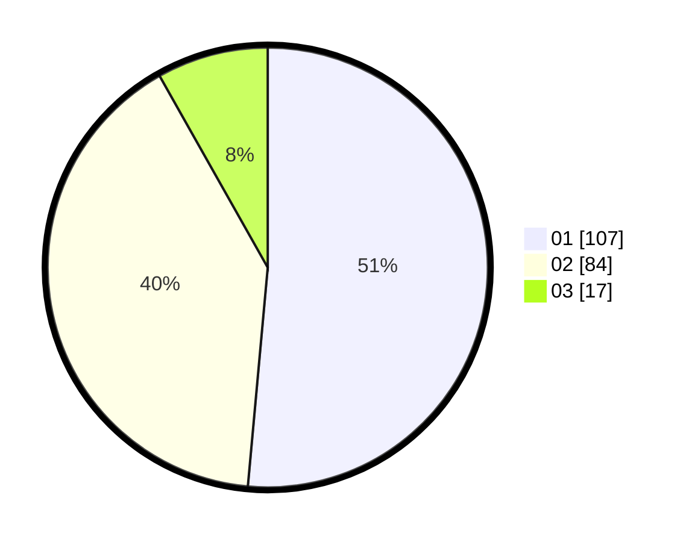

# Hasil

Hasil perolehan suara paslon dapat dilihat pada file paslon-01.txt, paslon-02.txt, dan paslon-03.txt.

Jika tidak ada, artinya data tersebut belum ada pada SIREKAP.

## Perolehan Suara

 * Paslon 01: **107**.
 * Paslon 02: **84**.
 * Paslon 03: **17**.

## Foto C Plano

https://sirekap-obj-formc.kpu.go.id/7ca6/pemilu/ppwp/31/73/06/10/04/3173061004028-20240216-030119--3f7f7c0e-8770-4b7f-978b-ba7ba490dd1a.jpg

https://sirekap-obj-formc.kpu.go.id/7ca6/pemilu/ppwp/31/73/06/10/04/3173061004028-20240216-085504--97b8832c-6aff-47c1-8722-c6abbc7dea91.jpg

https://sirekap-obj-formc.kpu.go.id/7ca6/pemilu/ppwp/31/73/06/10/04/3173061004028-20240216-025424--4fd2154b-df1f-4876-bc6b-837c2b69fbe0.jpg

## DATA PEMILIH TETAP

Jumlah pemilih dalam DPT: **254**.
 * L: **120**.
 * P: **134**.

## DATA PENGGUNA HAK PILIH

Jumlah pengguna hak pilih dalam DPT: **207**.
 * L: **91**.
 * P: **116**.

Jumlah pengguna hak pilih dalam DPTb: **2**.
 * L: **1**.
 * P: **1**.

Jumlah pengguna hak pilih dalam DPK: **2**.
 * L: **1**.
 * P: **1**.

Jumlah pengguna hak pilih: **211**.
 * L: **93**.
 * P: **118**.

## JUMLAH SUARA SAH DAN TIDAK SAH

JUMLAH SELURUH SUARA SAH: **208**.

JUMLAH SUARA TIDAK SAH: **3**.

JUMLAH SELURUH SUARA SAH DAN SUARA TIDAK SAH: **211**.
