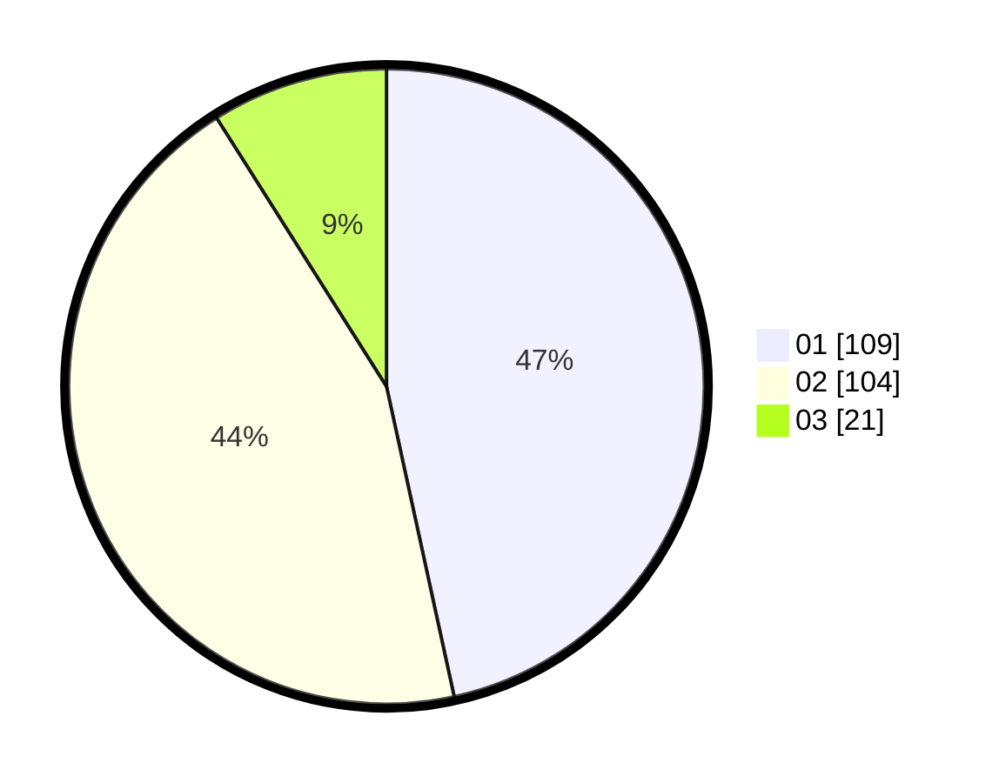

# Hasil

Hasil perolehan suara paslon dapat dilihat pada file paslon-01.txt, paslon-02.txt, dan paslon-03.txt.

Jika tidak ada, artinya data tersebut belum ada pada SIREKAP.

## Perolehan Suara

 * Paslon 01: **109**.
 * Paslon 02: **104**.
 * Paslon 03: **21**.

## Foto C Plano

https://sirekap-obj-formc.kpu.go.id/8297/pemilu/ppwp/31/73/06/10/04/3173061004029-20240215-005149--08612df7-274d-4d37-a91f-e8c9857bc3e4.jpg

https://sirekap-obj-formc.kpu.go.id/8297/pemilu/ppwp/31/73/06/10/04/3173061004029-20240215-004946--0ed698d0-f1fc-4fee-b7df-c2ca84d18ab6.jpg

https://sirekap-obj-formc.kpu.go.id/8297/pemilu/ppwp/31/73/06/10/04/3173061004029-20240215-005052--45fa226c-0712-433e-a459-52bb2694b2f7.jpg
