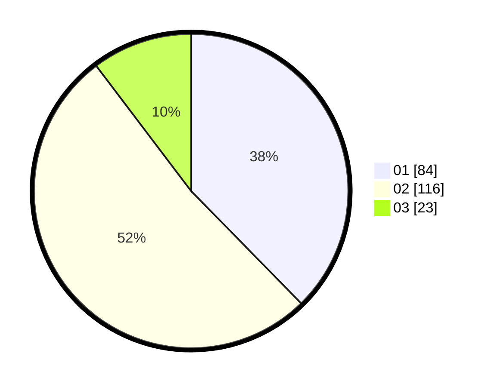

# Hasil

Hasil perolehan suara paslon dapat dilihat pada file paslon-01.txt, paslon-02.txt, dan paslon-03.txt.

Jika tidak ada, artinya data tersebut belum ada pada SIREKAP.

## Perolehan Suara

 * Paslon 01: **84**.
 * Paslon 02: **116**.
 * Paslon 03: **23**.

## Foto C Plano

https://sirekap-obj-formc.kpu.go.id/f47e/pemilu/ppwp/31/73/06/10/04/3173061004033-20240214-234719--0a36a956-bac2-4dd2-8ae1-e90d533366ef.jpg

https://sirekap-obj-formc.kpu.go.id/f47e/pemilu/ppwp/31/73/06/10/04/3173061004033-20240214-234809--481f089c-8627-465b-83e5-3ab9f5440e1c.jpg

https://sirekap-obj-formc.kpu.go.id/f47e/pemilu/ppwp/31/73/06/10/04/3173061004033-20240214-234953--1f459b0f-d94e-48e6-b725-1a60926a6822.jpg
